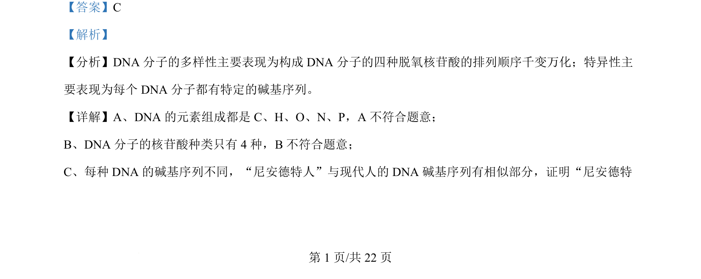
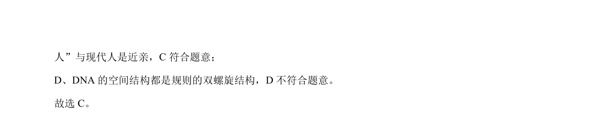

## 题面

## 摘要

DNA分子多样性和特异性的判断，依据碱基序列差异分析亲缘关系

## 关联考点

- [[DNA多样性]]
- [[DNA特异性]]
- [[碱基序列]]

## 答案与解析

> 📄 原 PDF 第 1 页：`素材/真题/北京/2008-2024·（北京）生物高考真题/2024年高考生物试卷（北京）（解析卷）.pdf`

<!-- 题干文本-start -->
## 题干文本
2. 科学家证明“尼安德特人”是现代人的近亲，依据的是 DNA 的（    ）
A. 元素组成 B. 核苷酸种类 C. 碱基序列 D. 空间结构
<!-- 题干文本-end -->

<!-- 解析文本-start -->
## 解析文本
【答案】C
【解析】
【分析】DNA 分子的多样性主要表现为构成 DNA 分子的四种脱氧核苷酸的排列顺序千变万化；特异性主
要表现为每个 DNA 分子都有特定的碱基序列。 
【详解】A、DNA 的元素组成都是 C、H、O、N、P，A 不符合题意；
B、DNA 分子的核苷酸种类只有 4 种，B不符合题意；
C、每种 DNA 的碱基序列不同，“尼安德特人”与现代人的 DNA 碱基序列有相似部分，证明“尼安德特
<!-- 解析文本-end -->
