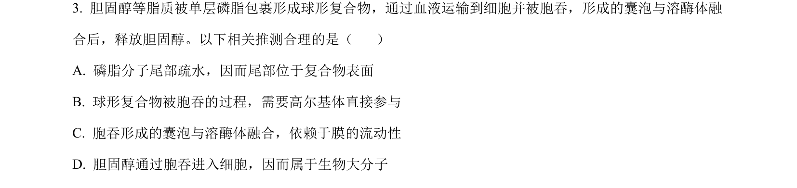
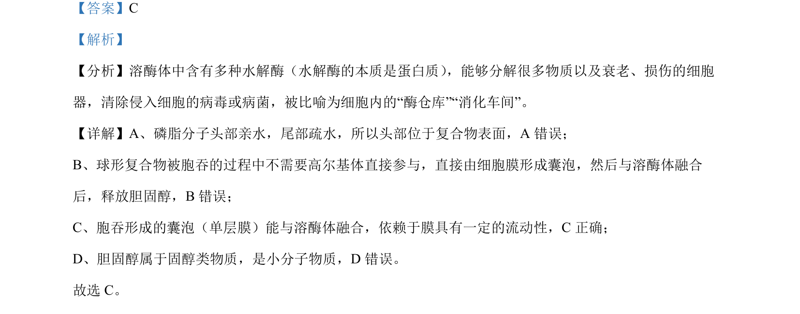

## 题面

## 摘要

通过改变环境条件提高光合作用氧气释放量，考查影响光合速率的外部因素。

## 关联考点

- [[033-光合作用|光合作用]]
- [[氧气释放量]]
- [[523-CO2浓度|CO2浓度]]
- [[736-光照强度|光照强度]]

## 答案与解析

> 📄 原 PDF 第 2 页：`素材/真题/北京/2008-2024·（北京）生物高考真题/2024年高考生物试卷（北京）（解析卷）.pdf`
