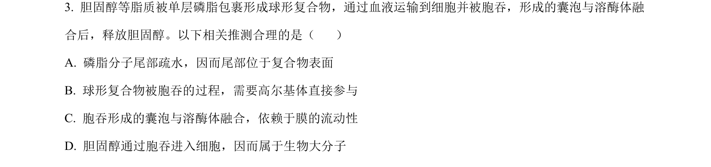
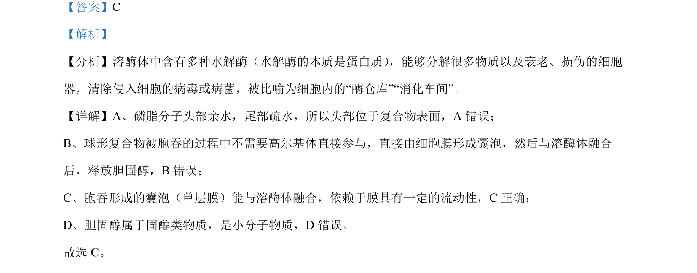

## 题面

## 摘要

通过改变环境条件提高光合作用氧气释放量，考查影响光合速率的外部因素。

## 关联考点

- [[033-光合作用|光合作用]]
- [[氧气释放量]]
- [[523-CO2浓度|CO2浓度]]
- [[736-光照强度|光照强度]]

## 答案与解析

> 📄 原 PDF 第 2 页：`素材/真题/北京/2008-2024·（北京）生物高考真题/2024年高考生物试卷（北京）（解析卷）.pdf`

<!-- 题干文本-start -->
## 题干文本
3. 胆固醇等脂质被单层磷脂包裹形成球形复合物，通过血液运输到细胞并被胞吞，形成的囊泡与溶酶体融
合后，释放胆固醇。以下相关推测合理的是（    ）
A. 磷脂分子尾部疏水，因而尾部位于复合物表面
B. 球形复合物被胞吞的过程，需要高尔基体直接参与
C. 胞吞形成的囊泡与溶酶体融合，依赖于膜的流动性
D. 胆固醇通过胞吞进入细胞，因而属于生物大分子
<!-- 题干文本-end -->

<!-- 解析文本-start -->
## 解析文本
【答案】C
【解析】
【分析】溶酶体中含有多种水解酶（水解酶的本质是蛋白质） ，能够分解很多物质以及衰老、损伤的细胞
器，清除侵入细胞的病毒或病菌，被比喻为细胞内的“酶仓库”“消化车间”。
【详解】A、磷脂分子头部亲水，尾部疏水，所以头部位于复合物表面，A 错误；
B、球形复合物被胞吞的过程中不需要高尔基体直接参与，直接由细胞膜形成囊泡，然后与溶酶体融合
后，释放胆固醇，B错误；
C、胞吞形成的囊泡（单层膜）能与溶酶体融合，依赖于膜具有一定的流动性，C正确；
D、胆固醇属于固醇类物质，是小分子物质，D 错误。
故选 C。
<!-- 解析文本-end -->
