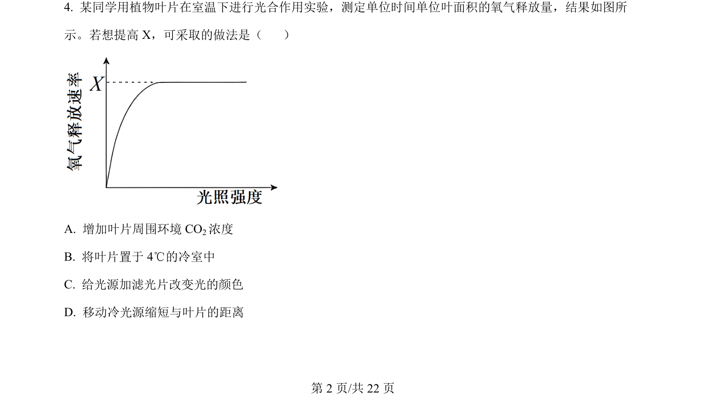
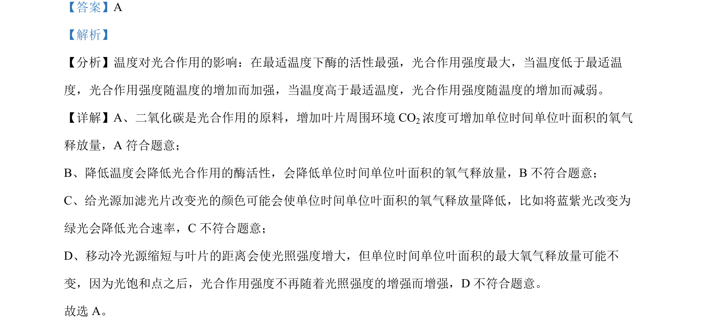

## 题面

## 摘要

考查温度、CO2浓度、光质和光照强度对光合速率的影响。

## 关联考点

- [[033-光合作用|光合作用]]
- [[819-影响光合作用的因素|影响光合作用的因素]]
- [[518-酶活性|酶活性]]
- [[光饱和点]]

## 答案与解析

> 📄 原 PDF 第 2 页：`素材/真题/北京/2008-2024·（北京）生物高考真题/2024年高考生物试卷（北京）（解析卷）.pdf`
