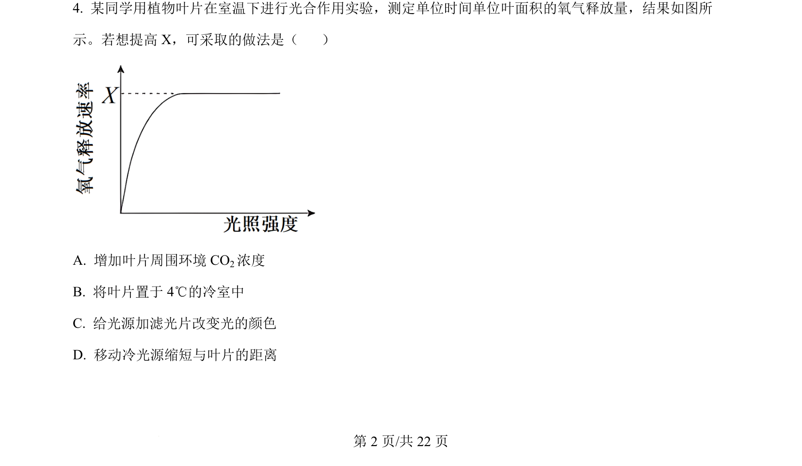
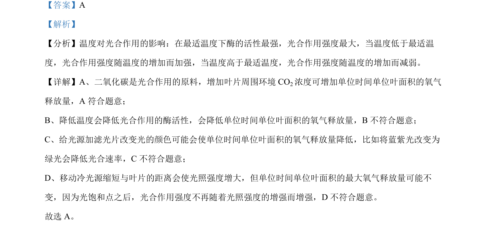

## 题面

## 摘要

考查温度、CO2浓度、光质和光照强度对光合速率的影响。

## 关联考点

- [[033-光合作用|光合作用]]
- [[819-影响光合作用的因素|影响光合作用的因素]]
- [[518-酶活性|酶活性]]
- [[光饱和点]]

## 答案与解析

> 📄 原 PDF 第 2 页：`素材/真题/北京/2008-2024·（北京）生物高考真题/2024年高考生物试卷（北京）（解析卷）.pdf`

<!-- 题干文本-start -->
## 题干文本
4. 某同学用植物叶片在室温下进行光合作用实验，测定单位时间单位叶面积的氧气释放量，结果如图所
示。若想提高 X，可采取的做法是（    ）
A. 增加叶片周围环境 CO2浓度
B. 将叶片置于 4℃的冷室中
C. 给光源加滤光片改变光的颜色
D. 移动冷光源缩短与叶片的距离
<!-- 题干文本-end -->

<!-- 解析文本-start -->
## 解析文本

<!-- 解析文本-end -->
