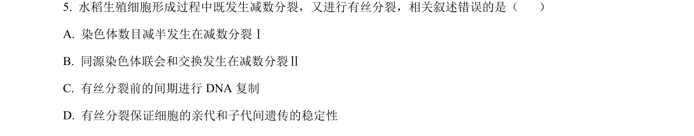
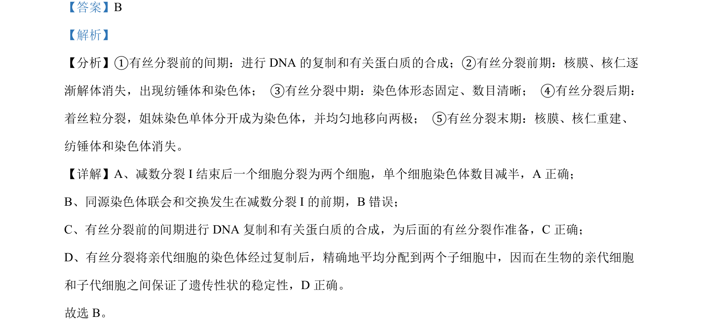

## 题面

## 摘要

有丝分裂各时期特征及与减数分裂的对比正误判断

## 关联考点

- [[046-细胞分裂|有丝分裂]]
- [[277-减数分裂（高中必二）|减数分裂]]
- [[285-DNA复制|DNA复制]]
- [[200-染色体|染色体]]

## 答案与解析

> 📄 原 PDF 第 3 页：`素材/真题/北京/2008-2024·（北京）生物高考真题/2024年高考生物试卷（北京）（解析卷）.pdf`
