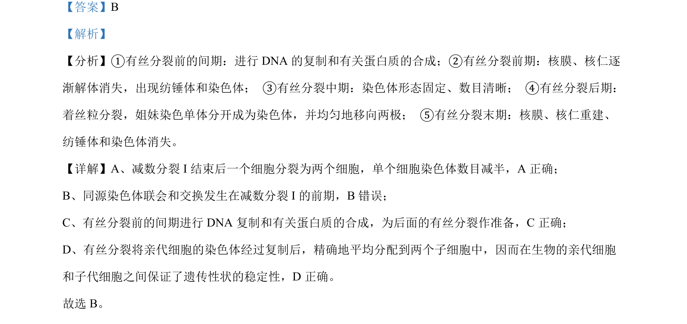

## 题面

## 摘要

有丝分裂各时期特征及与减数分裂的对比正误判断

## 关联考点

- [[046-细胞分裂|有丝分裂]]
- [[277-减数分裂（高中必二）|减数分裂]]
- [[285-DNA复制|DNA复制]]
- [[200-染色体|染色体]]

## 答案与解析

> 📄 原 PDF 第 3 页：`素材/真题/北京/2008-2024·（北京）生物高考真题/2024年高考生物试卷（北京）（解析卷）.pdf`

<!-- 题干文本-start -->
## 题干文本
5. 水稻生殖细胞形成过程中既发生减数分裂，又进行有丝分裂，相关叙述错误的是（    ）
A. 染色体数目减半发生在减数分裂Ⅰ
B. 同源染色体联会和交换发生在减数分裂Ⅱ
C. 有丝分裂前的间期进行 DNA 复制
D. 有丝分裂保证细胞的亲代和子代间遗传的稳定性
<!-- 题干文本-end -->

<!-- 解析文本-start -->
## 解析文本
【答案】B
【解析】
【分析】①有丝分裂前的间期：进行 DNA 的复制和有关蛋白质的合成；②有丝分裂前期：核膜、核仁逐
渐解体消失，出现纺锤体和染色体； ③有丝分裂中期：染色体形态固定、数目清晰； ④有丝分裂后期：
着丝粒分裂，姐妹染色单体分开成为染色体，并均匀地移向两极； ⑤有丝分裂末期：核膜、核仁重建、
纺锤体和染色体消失。
【详解】A、减数分裂 I 结束后一个细胞分裂为两个细胞，单个细胞染色体数目减半，A 正确；
B、同源染色体联会和交换发生在减数分裂 I 的前期，B错误；
C、有丝分裂前的间期进行 DNA 复制和有关蛋白质的合成，为后面的有丝分裂作准备，C正确；
D、有丝分裂将亲代细胞的染色体经过复制后，精确地平均分配到两个子细胞中，因而在生物的亲代细胞
和子代细胞之间保证了遗传性状的稳定性，D 正确。
故选 B。
<!-- 解析文本-end -->
