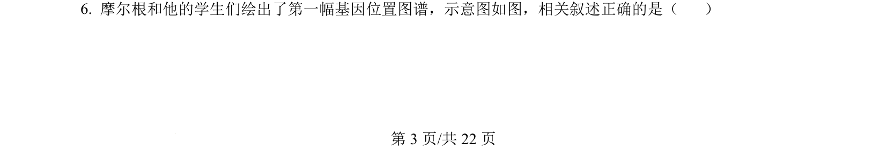
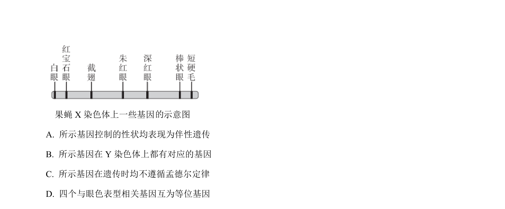
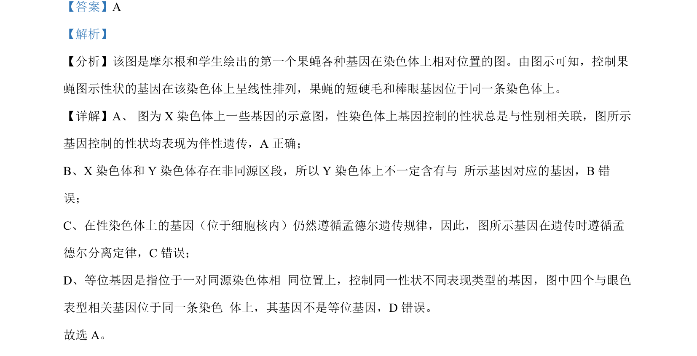

## 题面

## 摘要

本题考查果蝇X染色体上基因的线性排列、伴性遗传及等位基因概念辨析。

## 关联考点

- [[276-伴性遗传|伴性遗传]]
- [[基因在染色体上呈线性排列]]
- [[等位基因]]
- [[845-孟德尔分离定律|孟德尔分离定律]]

## 答案与解析

> 📄 原 PDF 第 3 页：`素材/真题/北京/2008-2024·（北京）生物高考真题/2024年高考生物试卷（北京）（解析卷）.pdf`
