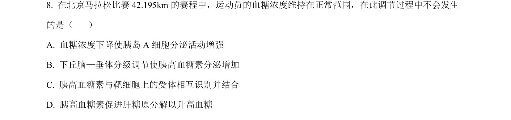
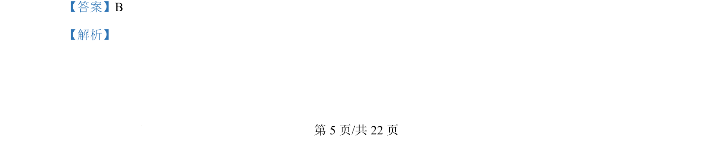
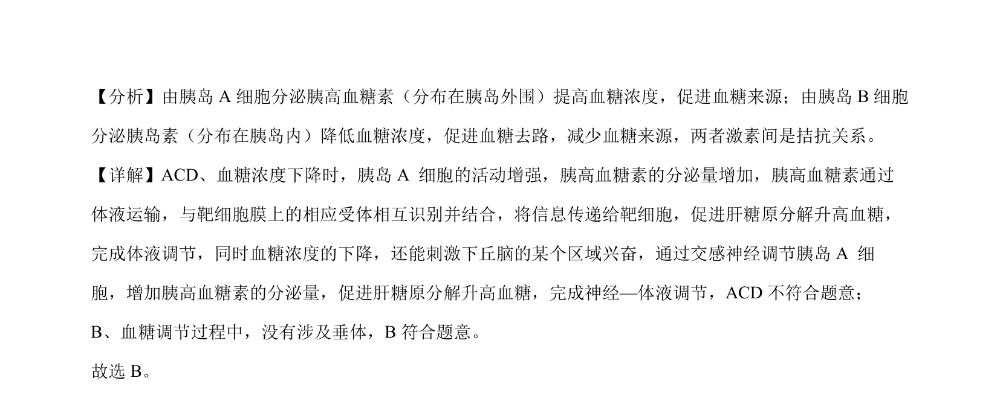

## 题面

## 摘要

血糖调节中神经-体液调节过程的分析，考察参与血糖调节的腺体与激素作用

## 关联考点

- [[512-血糖调节|血糖调节]]
- [[341-胰高血糖素|胰高血糖素]]
- [[胰岛A细胞]]
- [[662-神经-体液调节|神经-体液调节]]

## 答案与解析

> 📄 原 PDF 第 5 页：`素材/真题/北京/2008-2024·（北京）生物高考真题/2024年高考生物试卷（北京）（解析卷）.pdf`
