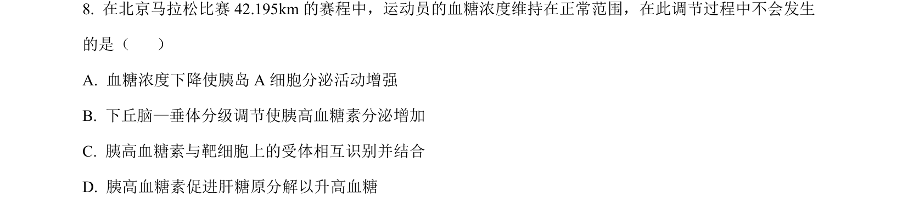
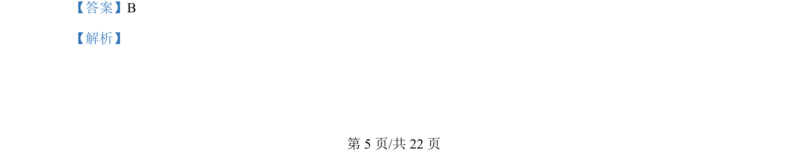
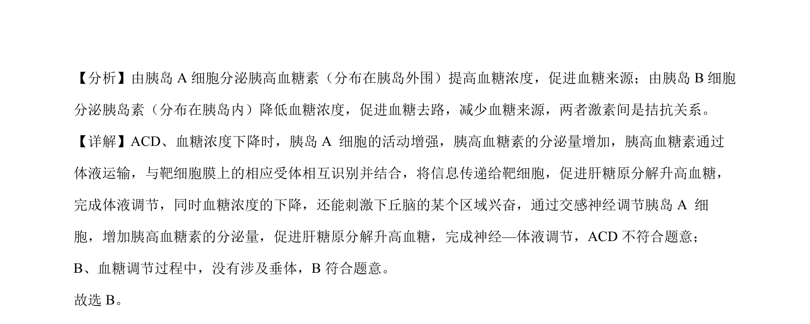

## 题面

## 摘要

血糖调节中神经-体液调节过程的分析，考察参与血糖调节的腺体与激素作用

## 关联考点

- [[512-血糖调节|血糖调节]]
- [[341-胰高血糖素|胰高血糖素]]
- [[胰岛A细胞]]
- [[662-神经-体液调节|神经-体液调节]]

## 答案与解析

> 📄 原 PDF 第 5 页：`素材/真题/北京/2008-2024·（北京）生物高考真题/2024年高考生物试卷（北京）（解析卷）.pdf`

<!-- 题干文本-start -->
## 题干文本
8. 在北京马拉松比赛 42.195km的赛程中，运动员的血糖浓度维持在正常范围，在此调节过程中不会发生
的是（    ）
A. 血糖浓度下降使胰岛 A 细胞分泌活动增强
B. 下丘脑—垂体分级调节使胰高血糖素分泌增加
C. 胰高血糖素与靶细胞上的受体相互识别并结合
D. 胰高血糖素促进肝糖原分解以升高血糖
<!-- 题干文本-end -->

<!-- 解析文本-start -->
## 解析文本
【答案】B
【解析】
.
<!-- 解析文本-end -->
