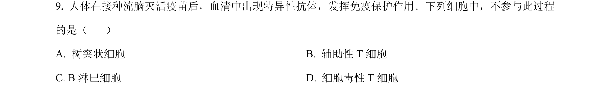
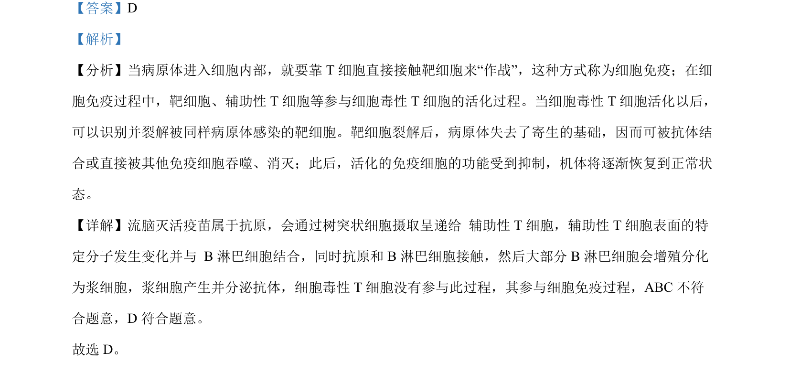

## 题面

## 摘要

灭活疫苗引发体液免疫，区分辅助性T细胞与细胞毒性T细胞的作用

## 关联考点

- [[353-体液免疫|体液免疫]]
- [[辅助性T细胞]]
- [[细胞毒性T细胞]]
- [[489-抗原呈递|抗原呈递]]

## 答案与解析

> 📄 原 PDF 第 6 页：`素材/真题/北京/2008-2024·（北京）生物高考真题/2024年高考生物试卷（北京）（解析卷）.pdf`
