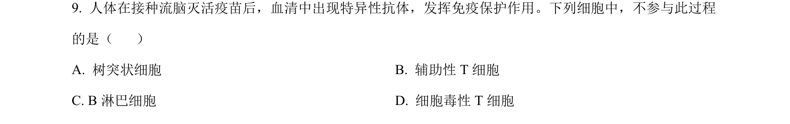
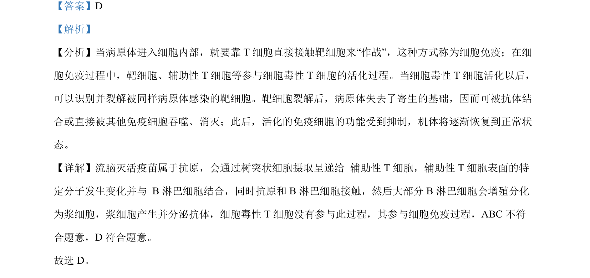

## 题面

## 摘要

灭活疫苗引发体液免疫，区分辅助性T细胞与细胞毒性T细胞的作用

## 关联考点

- [[353-体液免疫|体液免疫]]
- [[辅助性T细胞]]
- [[细胞毒性T细胞]]
- [[489-抗原呈递|抗原呈递]]

## 答案与解析

> 📄 原 PDF 第 6 页：`素材/真题/北京/2008-2024·（北京）生物高考真题/2024年高考生物试卷（北京）（解析卷）.pdf`

<!-- 题干文本-start -->
## 题干文本
9. 人体在接种流脑灭活疫苗后，血清中出现特异性抗体，发挥免疫保护作用。下列细胞中，不参与此过程
的是（    ）
A. 树突状细胞 B. 辅助性 T细胞
C. B淋巴细胞 D. 细胞毒性 T细胞
<!-- 题干文本-end -->

<!-- 解析文本-start -->
## 解析文本
【答案】D
【解析】
【分析】当病原体进入细胞内部，就要靠 T细胞直接接触靶细胞来“作战”，这种方式称为细胞免疫；在细
胞免疫过程中，靶细胞、辅助性 T细胞等参与细胞毒性 T细胞的活化过程。当细胞毒性 T细胞活化以后，
可以识别并裂解被同样病原体感染的靶细胞。靶细胞裂解后，病原体失去了寄生的基础，因而可被抗体结
合或直接被其他免疫细胞吞噬、消灭；此后，活化的免疫细胞的功能受到抑制，机体将逐渐恢复到正常状
态。
【详解】流脑灭活疫苗属于抗原，会通过树突状细胞摄取呈递给 辅助性 T细胞，辅助性 T细胞表面的特
定分子发生变化并与 B 淋巴细胞结合，同时抗原和 B淋巴细胞接触，然后大部分 B淋巴细胞会增殖分化
为浆细胞，浆细胞产生并分泌抗体，细胞毒性 T细胞没有参与此过程，其参与细胞免疫过程，ABC 不符
合题意，D 符合題意。
故选 D。
<!-- 解析文本-end -->
