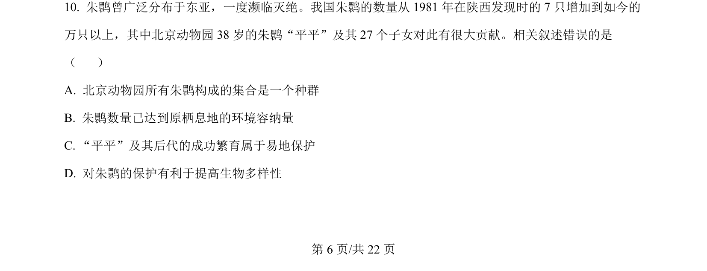
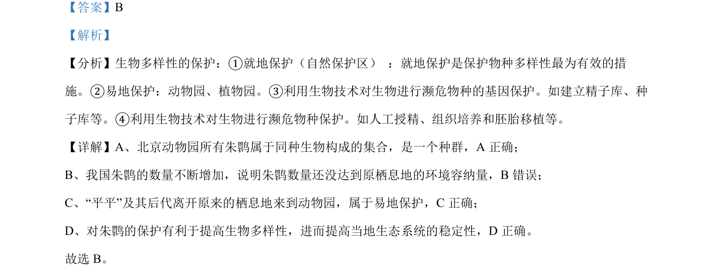

## 题面

## 摘要

体外诱导胚胎干细胞形成类囊胚，考查细胞分化和胚胎工程技术应用。

## 关联考点

- [[446-胚胎干细胞|胚胎干细胞]]
- [[045-细胞分化|细胞分化]]
- [[囊胚]]
- [[456-胚胎移植|胚胎移植]]

## 答案与解析

> 📄 原 PDF 第 6 页：`素材/真题/北京/2008-2024·（北京）生物高考真题/2024年高考生物试卷（北京）（解析卷）.pdf`

<!-- 题干文本-start -->
## 题干文本
10. 朱鹮曾广泛分布于东亚，一度濒临灭绝。我国朱鹮的数量从 1981 年在陕西发现时的 7 只增加到如今的
万只以上，其中北京动物园 38 岁的朱鹮“平平”及其 27 个子女对此有很大贡献。相关叙述错误的是
（    ）
A. 北京动物园所有朱鹮构成的集合是一个种群
B. 朱鹮数量已达到原栖息地的环境容纳量
C. “平平”及其后代的成功繁育属于易地保护
D. 对朱鹮的保护有利于提高生物多样性
<!-- 题干文本-end -->

<!-- 解析文本-start -->
## 解析文本

<!-- 解析文本-end -->
