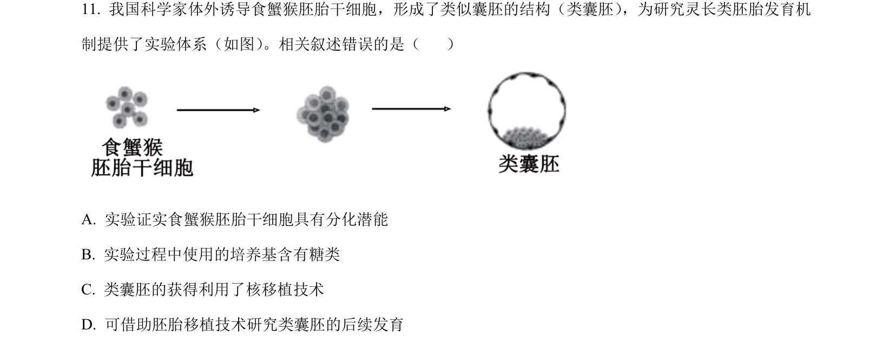
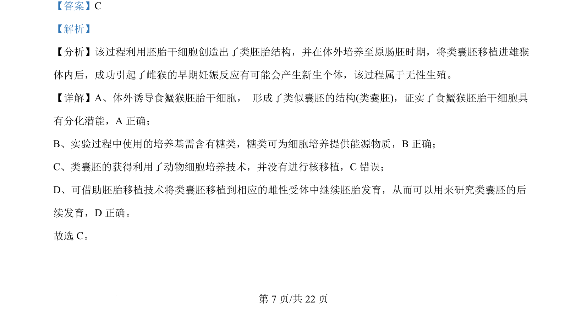

## 题面

## 摘要

该题以食蟹猴胚胎干细胞形成类囊胚为情境，考查细胞分化、动物细胞培养、核移植及胚胎移植等知识。

## 关联考点

- [[446-胚胎干细胞|胚胎干细胞]]
- [[045-细胞分化|细胞分化]]
- [[449-动物细胞培养|动物细胞培养]]
- [[456-胚胎移植|胚胎移植]]

## 答案与解析

> 📄 原 PDF 第 7 页：`素材/真题/北京/2008-2024·（北京）生物高考真题/2024年高考生物试卷（北京）（解析卷）.pdf`
