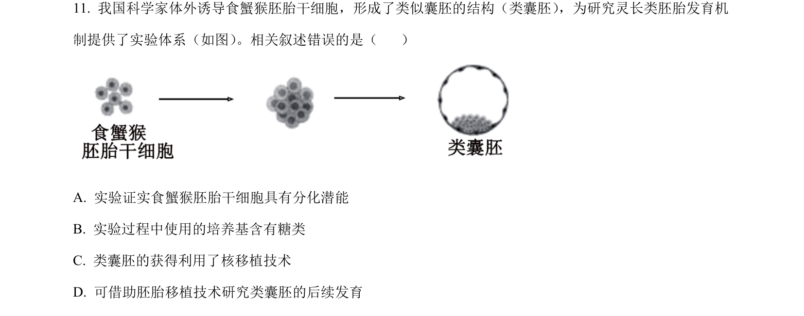
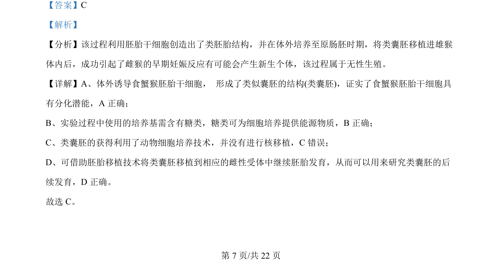

## 题面

## 摘要

该题以食蟹猴胚胎干细胞形成类囊胚为情境，考查细胞分化、动物细胞培养、核移植及胚胎移植等知识。

## 关联考点

- [[446-胚胎干细胞|胚胎干细胞]]
- [[045-细胞分化|细胞分化]]
- [[449-动物细胞培养|动物细胞培养]]
- [[456-胚胎移植|胚胎移植]]

## 答案与解析

> 📄 原 PDF 第 7 页：`素材/真题/北京/2008-2024·（北京）生物高考真题/2024年高考生物试卷（北京）（解析卷）.pdf`

<!-- 题干文本-start -->
## 题干文本
11. 我国科学家体外诱导食蟹猴胚胎干细胞，形成了类似囊胚的结构（类囊胚） ，为研究灵长类胚胎发育机
制提供了实验体系（如图） 。相关叙述错误的是（    ）
A. 实验证实食蟹猴胚胎干细胞具有分化潜能
B. 实验过程中使用的培养基含有糖类
C. 类囊胚的获得利用了核移植技术
D. 可借助胚胎移植技术研究类囊胚的后续发育
<!-- 题干文本-end -->

<!-- 解析文本-start -->
## 解析文本
【答案】C
【解析】
【分析】该过程利用胚胎干细胞创造出了类胚胎结构，并在体外培养至原肠胚时期，将类囊胚移植进雄猴
体内后，成功引起了雌猴的早期妊娠反应有可能会产生新生个体，该过程属于无性生殖。
【详解】A、体外诱导食蟹猴胚胎干细胞， 形成了类似囊胚的结构(类囊胚)，证实了食蟹猴胚胎干细胞具
有分化潜能，A 正确；
B、实验过程中使用的培养基需含有糖类，糖类可为细胞培养提供能源物质，B正确；
C、类囊胚的获得利用了动物细胞培养技术，并没有进行核移植，C错误；
D、可借助胚胎移植技术将类囊胚移植到相应的雌性受体中继续胚胎发育，从而可以用来研究类囊胚的后
续发育，D 正确。
故选 C。
<!-- 解析文本-end -->
