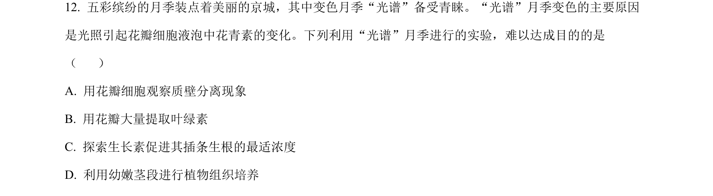
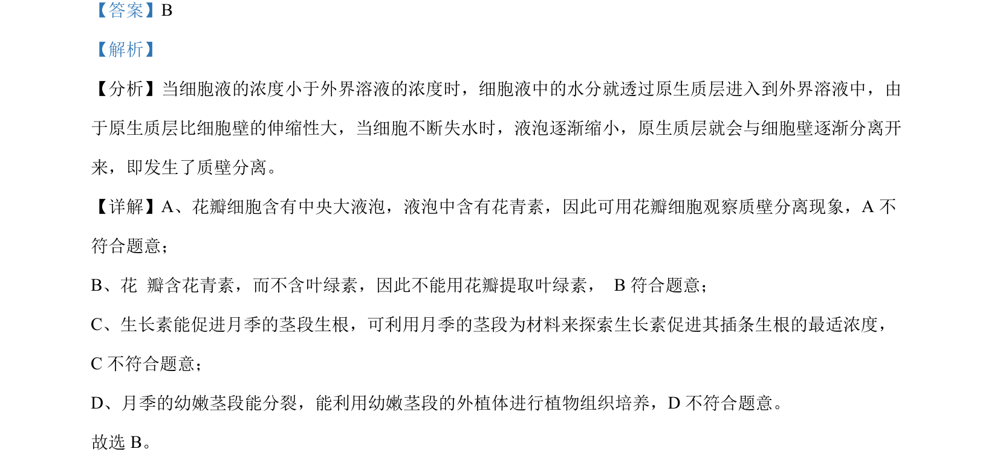

## 题面

## 摘要

考查原生质体的制备方法、膜特性、细胞壁再生及全能性

## 关联考点

- [[887-原生质体|原生质体]]
- [[912-纤维素酶|纤维素酶]]
- [[果胶酶]]
- [[249-细胞全能性|细胞全能性]]

## 答案与解析

> 📄 原 PDF 第 8 页：`素材/真题/北京/2008-2024·（北京）生物高考真题/2024年高考生物试卷（北京）（解析卷）.pdf`
