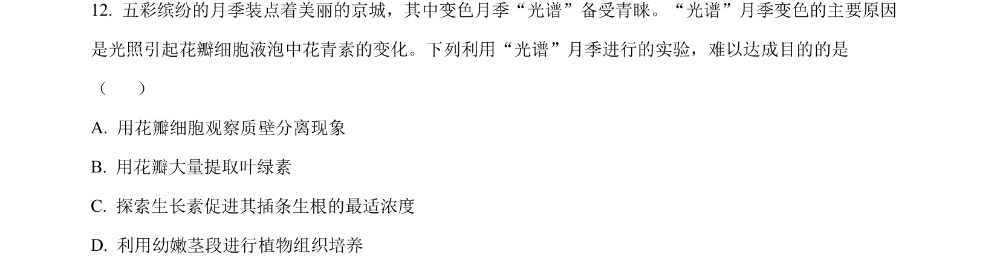
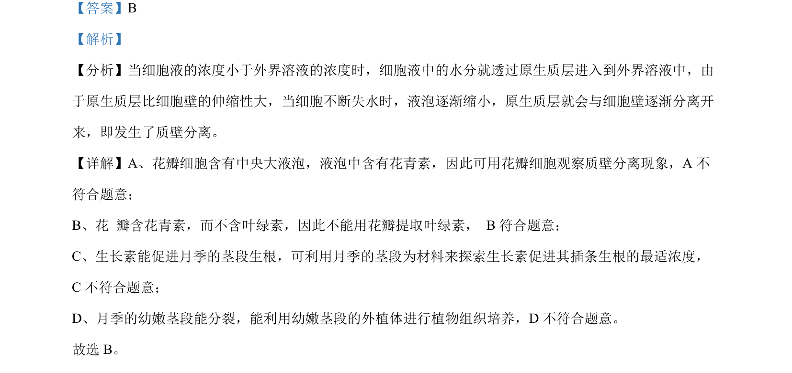

## 题面

## 摘要

考查原生质体的制备方法、膜特性、细胞壁再生及全能性

## 关联考点

- [[887-原生质体|原生质体]]
- [[912-纤维素酶|纤维素酶]]
- [[果胶酶]]
- [[249-细胞全能性|细胞全能性]]

## 答案与解析

> 📄 原 PDF 第 8 页：`素材/真题/北京/2008-2024·（北京）生物高考真题/2024年高考生物试卷（北京）（解析卷）.pdf`

<!-- 题干文本-start -->
## 题干文本
12. 五彩缤纷的月季装点着美丽的京城，其中变色月季“光谱”备受青睐。“光谱”月季变色的主要原因
是光照引起花瓣细胞液泡中花青素的变化。下列利用“光谱”月季进行的实验，难以达成目的的是
（    ）
A. 用花瓣细胞观察质壁分离现象
B. 用花瓣大量提取叶绿素
C. 探索生长素促进其插条生根的最适浓度
D. 利用幼嫩茎段进行植物组织培养
<!-- 题干文本-end -->

<!-- 解析文本-start -->
## 解析文本
【答案】B
【解析】
【分析】当细胞液的浓度小于外界溶液的浓度时，细胞液中的水分就透过原生质层进入到外界溶液中，由
于原生质层比细胞壁的伸缩性大，当细胞不断失水时，液泡逐渐缩小，原生质层就会与细胞壁逐渐分离开
来，即发生了质壁分离。
【详解】A、花瓣细胞含有中央大液泡，液泡中含有花青素，因此可用花瓣细胞观察质壁分离现象，A 不
符合题意；
B、花 瓣含花青素，而不含叶绿素，因此不能用花瓣提取叶绿素， B 符合题意；
C、生长素能促进月季的茎段生根，可利用月季的茎段为材料来探索生长素促进其插条生根的最适浓度，
C不符合题意；
D、月季的幼嫩茎段能分裂，能利用幼嫩茎段的外植体进行植物组织培养，D 不符合题意。
故选 B。
<!-- 解析文本-end -->
