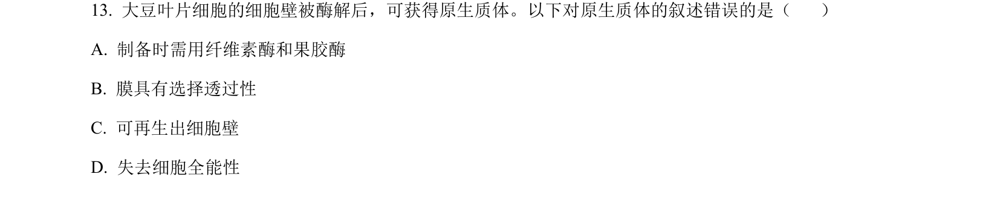
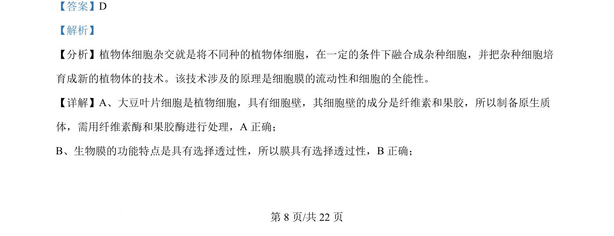
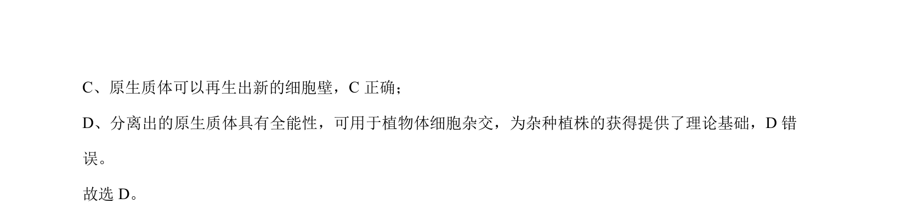

## 题面

## 摘要

本题考查植物体细胞杂交技术及原生质体相关知识的理解

## 关联考点

- [[436-植物体细胞杂交|植物体细胞杂交]]
- [[887-原生质体|原生质体]]
- [[249-细胞全能性|细胞全能性]]
- [[细胞膜流动性]]

## 答案与解析

> 📄 原 PDF 第 8 页：`素材/真题/北京/2008-2024·（北京）生物高考真题/2024年高考生物试卷（北京）（解析卷）.pdf`
