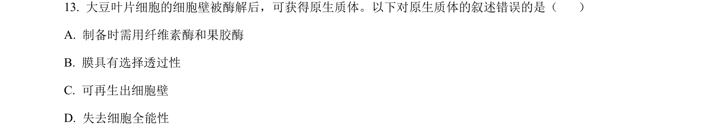
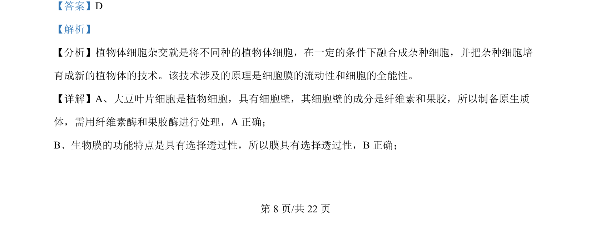
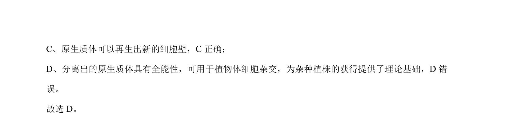

## 题面

## 摘要

本题考查植物体细胞杂交技术及原生质体相关知识的理解

## 关联考点

- [[436-植物体细胞杂交|植物体细胞杂交]]
- [[887-原生质体|原生质体]]
- [[249-细胞全能性|细胞全能性]]
- [[细胞膜流动性]]

## 答案与解析

> 📄 原 PDF 第 8 页：`素材/真题/北京/2008-2024·（北京）生物高考真题/2024年高考生物试卷（北京）（解析卷）.pdf`

<!-- 题干文本-start -->
## 题干文本
13. 大豆叶片细胞的细胞壁被酶解后，可获得原生质体。以下对原生质体的叙述错误的是（    ）
A. 制备时需用纤维素酶和果胶酶
B. 膜具有选择透过性
C. 可再生出细胞壁
D. 失去细胞全能性
<!-- 题干文本-end -->

<!-- 解析文本-start -->
## 解析文本
【答案】D
【解析】
【分析】植物体细胞杂交就是将不同种的植物体细胞，在一定的条件下融合成杂种细胞，并把杂种细胞培
育成新的植物体的技术。该技术涉及的原理是细胞膜的流动性和细胞的全能性。
【详解】A、大豆叶片细胞是植物细胞，具有细胞壁，其细胞壁的成分是纤维素和果胶，所以制备原生质
体，需用纤维素酶和果胶酶进行处理，A 正确；
B、生物膜的功能特点是具有选择透过性，所以膜具有选择透过性，B正确；
<!-- 解析文本-end -->
