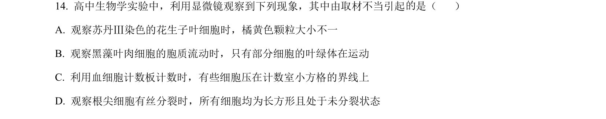
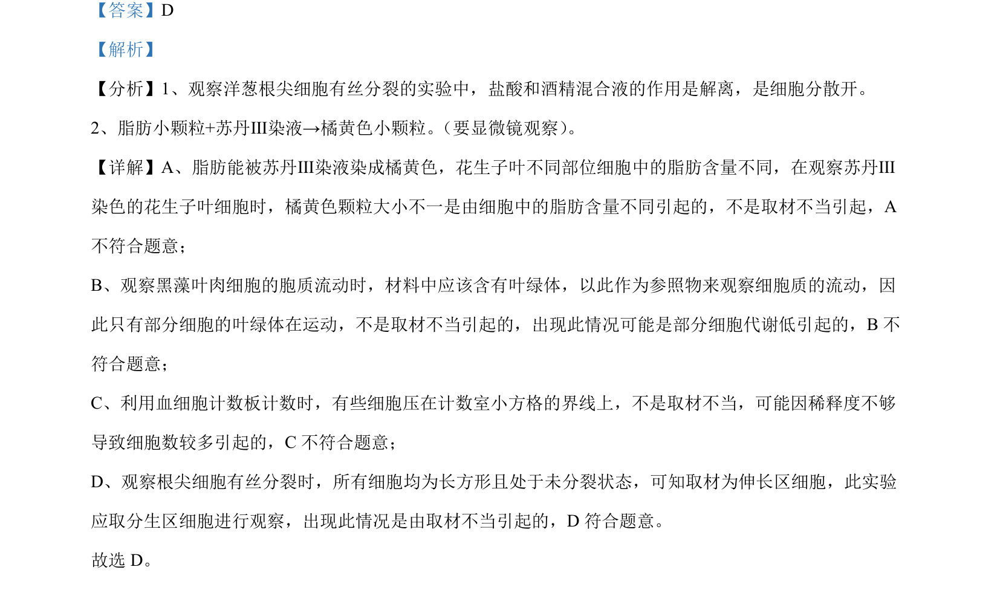

## 题面

## 摘要

观察实验取材不当的判断，涉及脂肪鉴定、胞质流动等实验异常原因分析

## 关联考点

- [[922-脂肪鉴定|脂肪鉴定]]
- [[胞质流动]]
- [[血细胞计数板]]
- [[根尖有丝分裂]]

## 答案与解析

> 📄 原 PDF 第 9 页：`素材/真题/北京/2008-2024·（北京）生物高考真题/2024年高考生物试卷（北京）（解析卷）.pdf`

<!-- 题干文本-start -->
## 题干文本
14. 高中生物学实验中，利用显微镜观察到下列现象，其中由取材不当引起 是（     ）
A. 观察苏丹Ⅲ染色的花生子叶细胞时，橘黄色颗粒大小不一
B. 观察黑藻叶肉细胞的胞质流动时，只有部分细胞的叶绿体在运动
C. 利用血细胞计数板计数时，有些细胞压在计数室小方格的界线上
D. 观察根尖细胞有丝分裂时，所有细胞均为长方形且处于未分裂状态
<!-- 题干文本-end -->

<!-- 解析文本-start -->
## 解析文本
【答案】D
【解析】
【分析】1、观察洋葱根尖细胞有丝分裂的实验中，盐酸和酒精混合液的作用是解离，是细胞分散开。
2、脂肪小颗粒+苏丹Ⅲ染液→橘黄色小颗粒。 （要显微镜观察） 。
【详解】A、脂肪能被苏丹Ⅲ染液染成橘黄色，花生子叶不同部位细胞中的脂肪含量不同，在观察苏丹Ⅲ
染色的花生子叶细胞时，橘黄色颗粒大小不一是由细胞中的脂肪含量不同引起的，不是取材不当引起，A
不符合题意；
B、观察黑藻叶肉细胞的胞质流动时，材料中应该含有叶绿体，以此作为参照物来观察细胞质的流动，因
此只有部分细胞的叶绿体在运动，不是取材不当引起的，出现此情况可能是部分细胞代谢低引起的，B不
符合题意；
C、利用血细胞计数板计数时，有些细胞压在计数室小方格的界线上，不是取材不当，可能因稀释度不够
导致细胞数较多引起的，C不符合题意；
D、观察根尖细胞有丝分裂时，所有细胞均为长方形且处于未分裂状态，可知取材为伸长区细胞，此实验
应取分生区细胞进行观察，出现此情况是由取材不当引起的，D 符合题意。
故选 D。
<!-- 解析文本-end -->
