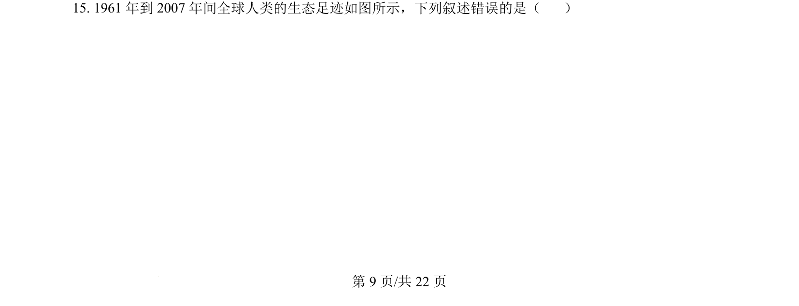
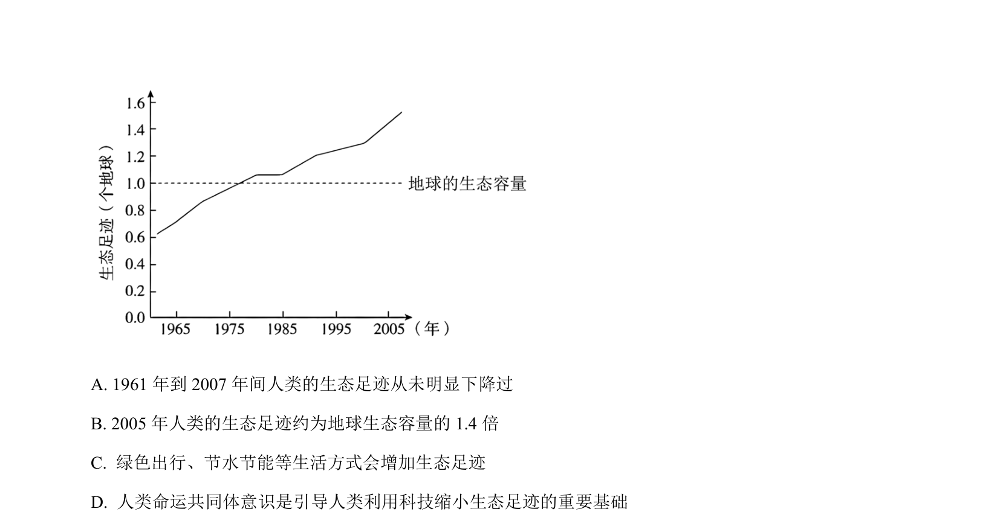
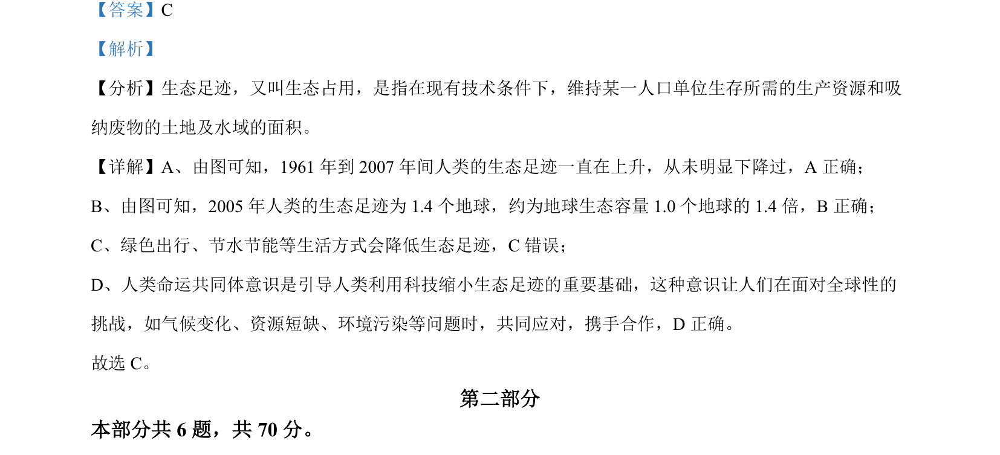

## 题面

## 摘要

考查生态足迹变化趋势及人类活动影响，以及花葵传粉中的种间关系与小岛进化优势。

## 关联考点

- [[400-生态足迹|生态足迹]]
- [[022-生物因素|种间关系]]
- [[传粉]]
- [[隔离进化]]

## 答案与解析

> 📄 原 PDF 第 9 页：`素材/真题/北京/2008-2024·（北京）生物高考真题/2024年高考生物试卷（北京）（解析卷）.pdf`
