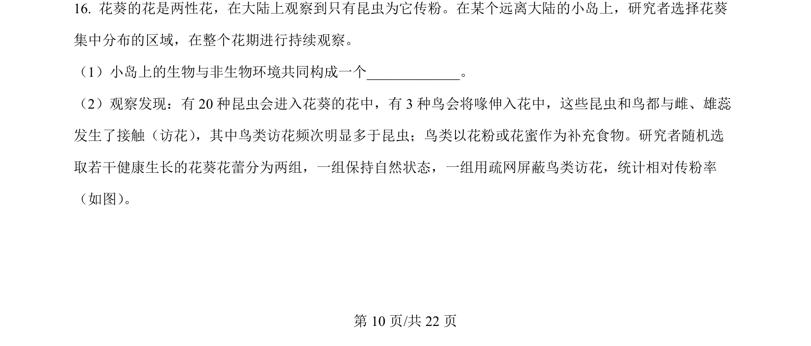
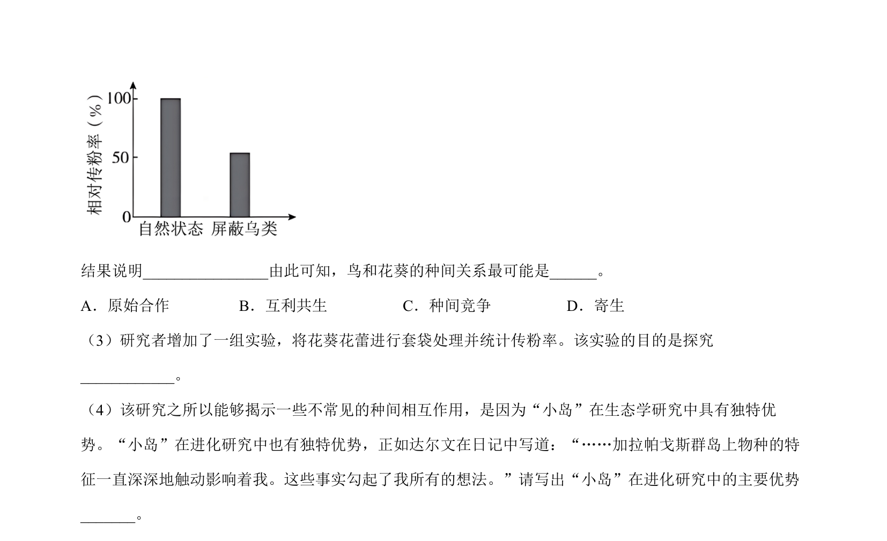
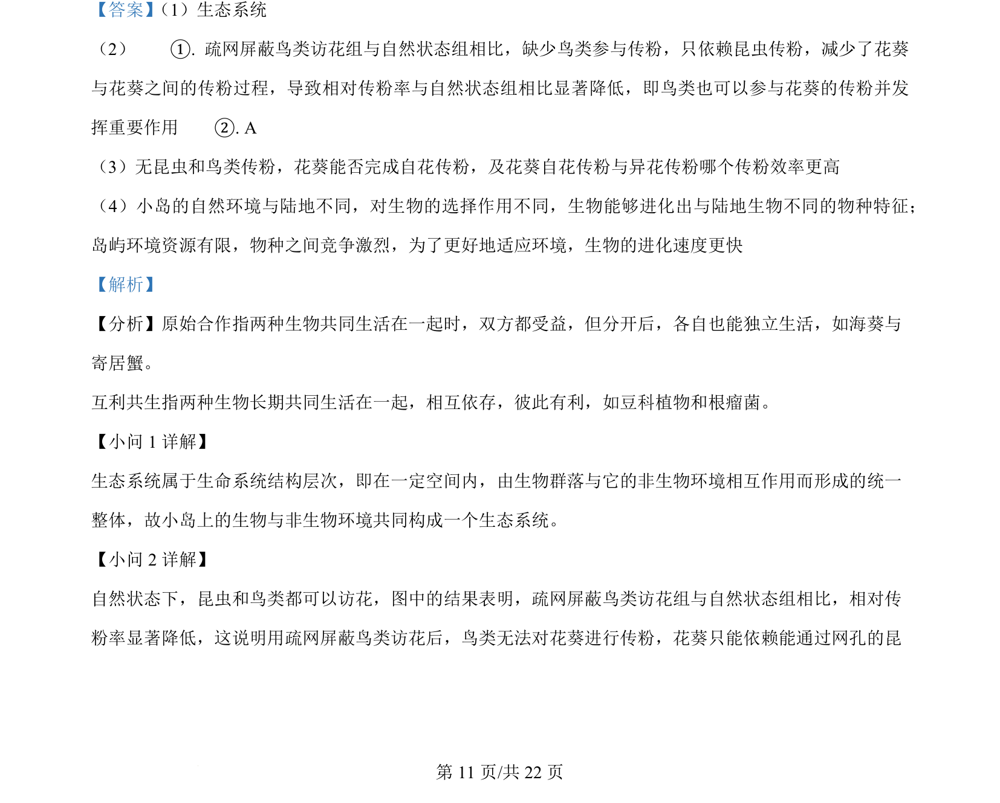
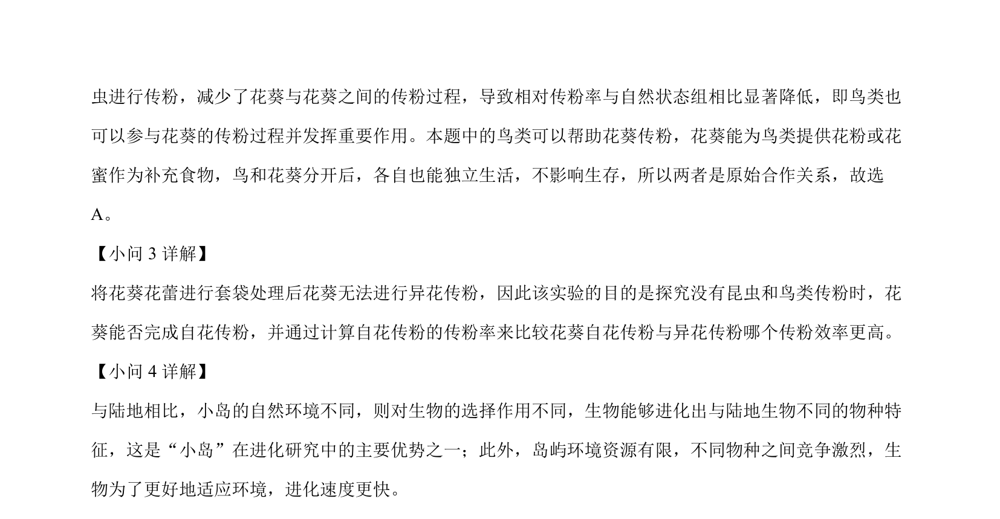

## 题面

## 摘要

本题以花葵传粉和酵母菌采集为情境，考查生态系统的组成、种间关系辨析、实验设计及酵母菌代谢调控分析。

## 关联考点

- [[020-生态系统|生态系统]]
- [[原始合作]]
- [[240-有氧呼吸|有氧呼吸]]
- [[884-过氧化氢酶|过氧化氢酶]]

## 答案与解析

> 📄 原 PDF 第 10 页：`素材/真题/北京/2008-2024·（北京）生物高考真题/2024年高考生物试卷（北京）（解析卷）.pdf`
