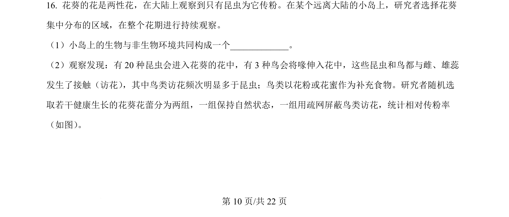
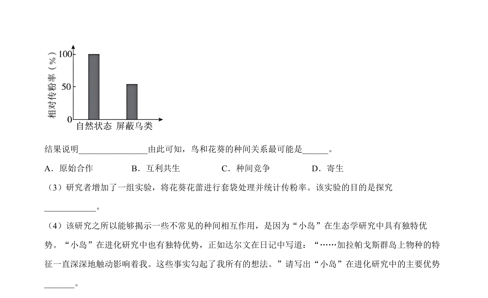
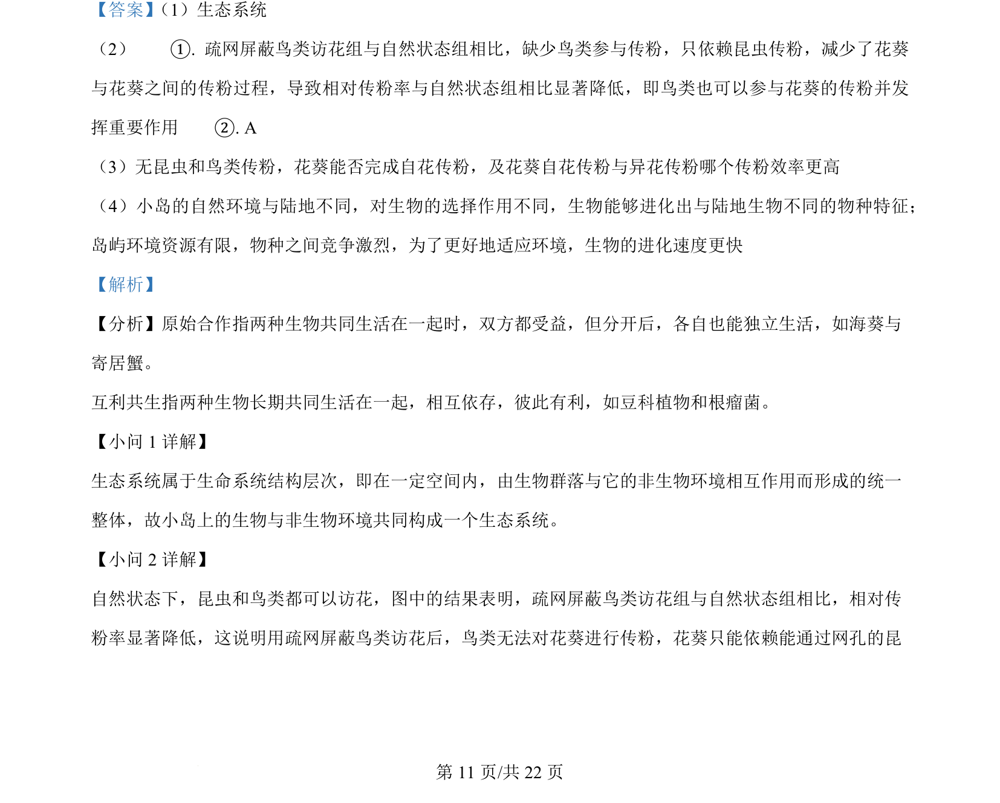
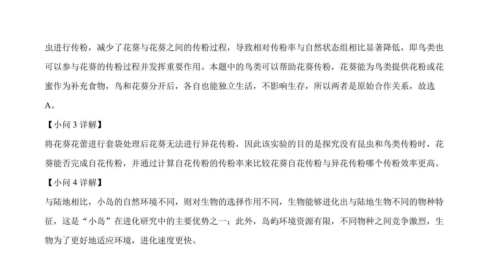

## 题面

## 摘要

本题以花葵传粉和酵母菌采集为情境，考查生态系统的组成、种间关系辨析、实验设计及酵母菌代谢调控分析。

## 关联考点

- [[020-生态系统|生态系统]]
- [[原始合作]]
- [[240-有氧呼吸|有氧呼吸]]
- [[884-过氧化氢酶|过氧化氢酶]]

## 答案与解析

> 📄 原 PDF 第 10 页：`素材/真题/北京/2008-2024·（北京）生物高考真题/2024年高考生物试卷（北京）（解析卷）.pdf`

<!-- 题干文本-start -->
## 题干文本
16. 花葵的花是两性花，在大陆上观察到只有昆虫为它传粉。在某个远离大陆的小岛上，研究者选择花葵
集中分布的区域，在整个花期进行持续观察。
（1）小岛上的生物与非生物环境共同构成一个_____________。
（2）观察发现：有 20 种昆虫会进入花葵的花中，有 3 种鸟会将喙伸入花中，这些昆虫和鸟都与雌、雄蕊
发生了接触（访花） ，其中鸟类访花频次明显多于昆虫；鸟类以花粉或花蜜作为补充食物。研究者随机选
取若干健康生长的花葵花蕾分为两组，一组保持自然状态，一组用疏网屏蔽鸟类访花，统计相对传粉率
（如图） 。
<!-- 题干文本-end -->

<!-- 解析文本-start -->
## 解析文本

<!-- 解析文本-end -->
