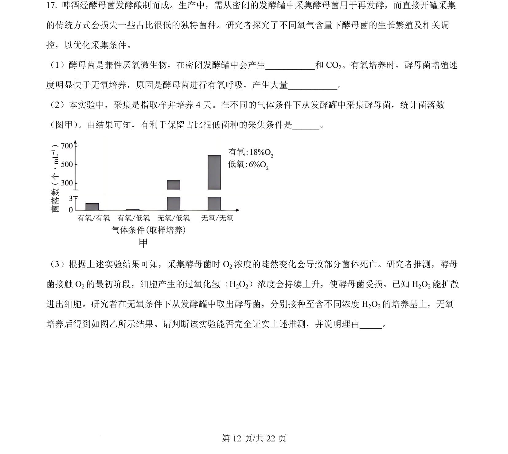
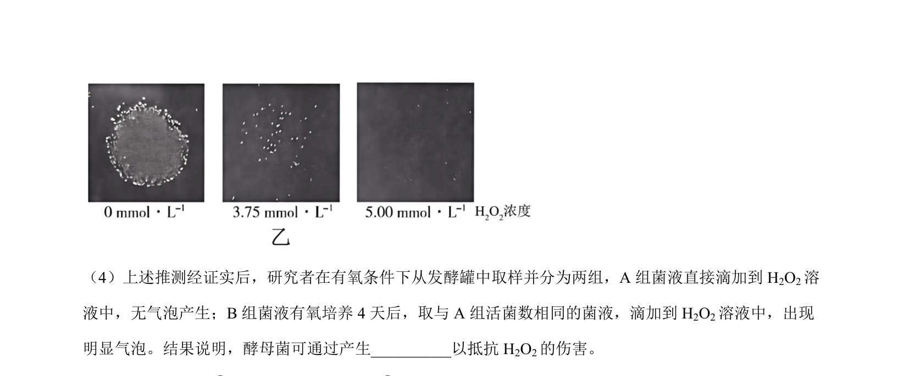
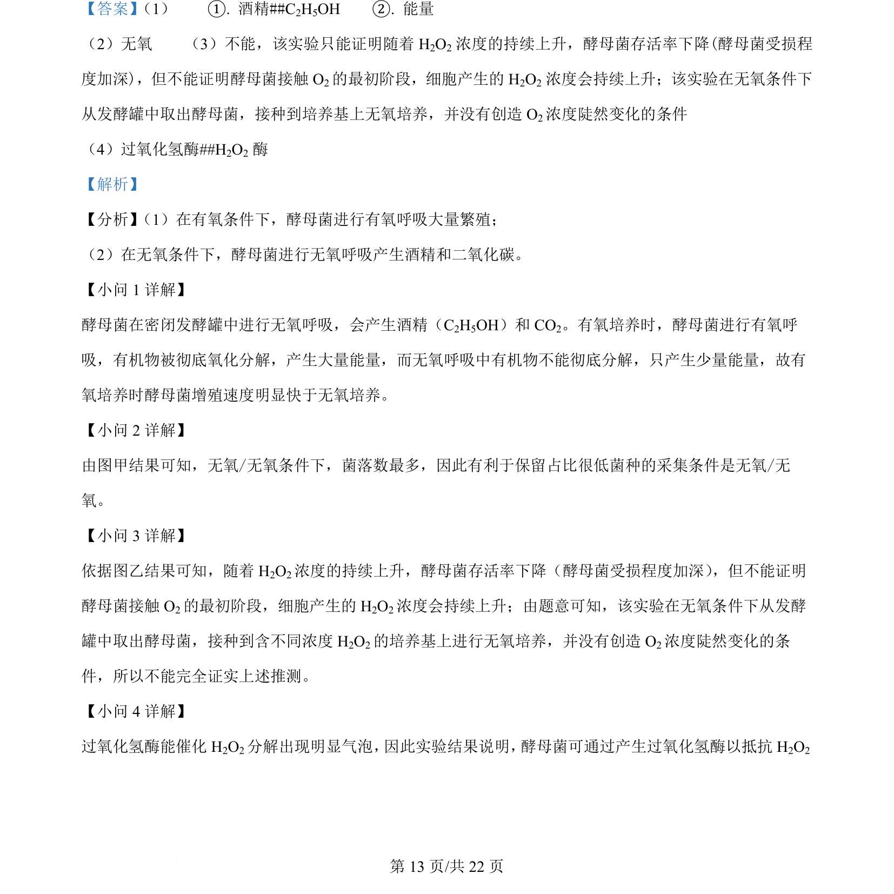

## 题面

## 摘要

该题考查酵母菌呼吸方式、菌种采集条件及H2O2影响，以及植物激素IAA和ABA对生长和逆境响应的调节机制。

## 关联考点

- [[238-无氧呼吸|无氧呼吸]]
- [[240-有氧呼吸|有氧呼吸]]
- [[过氧化氢酶]]
- [[347-生长素|生长素]]
- [[350-脱落酸|脱落酸]]

## 答案与解析

> 📄 原 PDF 第 12 页：`素材/真题/北京/2008-2024·（北京）生物高考真题/2024年高考生物试卷（北京）（解析卷）.pdf`
