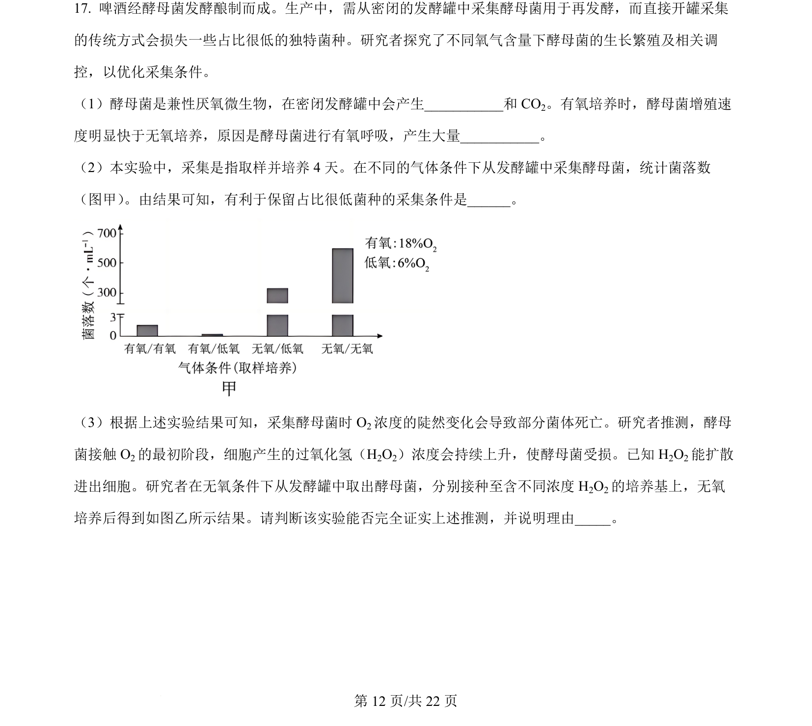
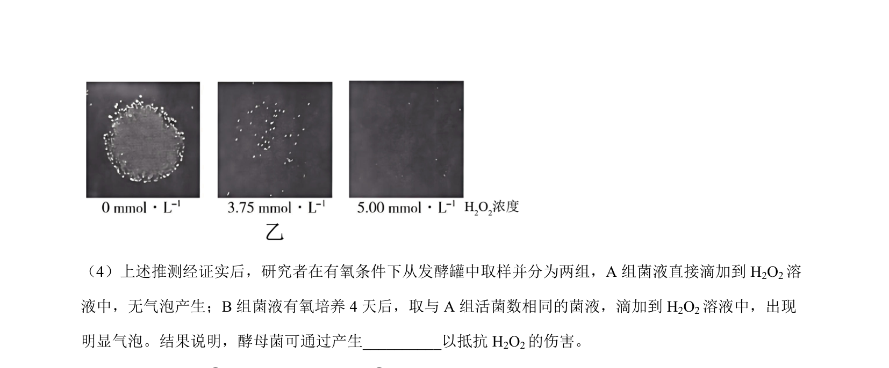
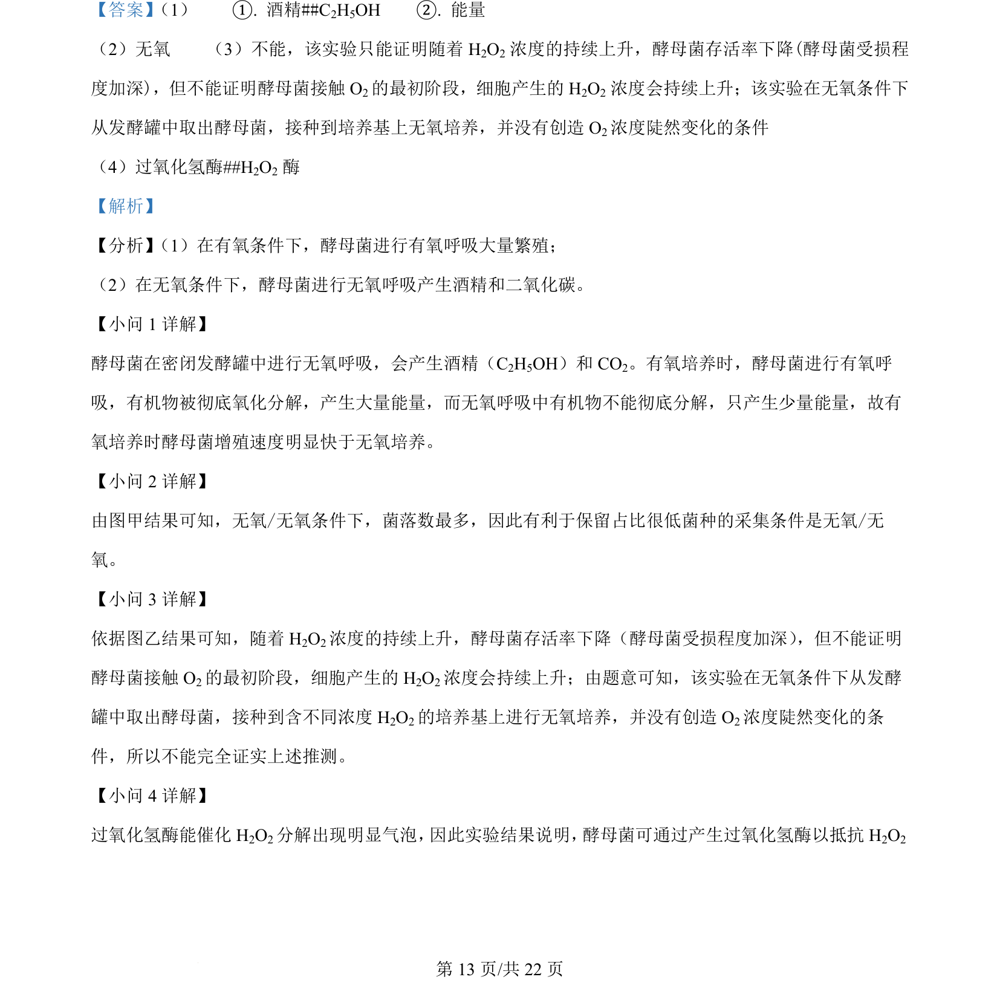

## 题面

## 摘要

该题考查酵母菌呼吸方式、菌种采集条件及H2O2影响，以及植物激素IAA和ABA对生长和逆境响应的调节机制。

## 关联考点

- [[238-无氧呼吸|无氧呼吸]]
- [[240-有氧呼吸|有氧呼吸]]
- [[884-过氧化氢酶|过氧化氢酶]]
- [[347-生长素|生长素]]
- [[350-脱落酸|脱落酸]]

## 答案与解析

> 📄 原 PDF 第 12 页：`素材/真题/北京/2008-2024·（北京）生物高考真题/2024年高考生物试卷（北京）（解析卷）.pdf`

<!-- 题干文本-start -->
## 题干文本
17. 啤酒经酵母菌发酵酿制而成。生产中，需从密闭的发酵罐中采集酵母菌用于再发酵，而直接开罐采集
的传统方式会损失一些占比很低的独特菌种。研究者探究了不同氧气含量下酵母菌的生长繁殖及相关调
控，以优化采集条件。
（1）酵母菌是兼性厌氧微生物，在密闭发酵罐中会产生___________和 CO2。有氧培养时，酵母菌增殖速
度明显快于无氧培养，原因是酵母菌进行有氧呼吸，产生大量___________。
（2）本实验中，采集是指取样并培养 4 天。在不同的气体条件下从发酵罐中采集酵母菌，统计菌落数
（图甲） 。由结果可知，有利于保留占比很低菌种的采集条件是______。
（3）根据上述实验结果可知，采集酵母菌时 O2浓度的陡然变化会导致部分菌体死亡。研究者推测，酵母
菌接触 O2的最初阶段，细胞产生的过氧化氢（H2O2）浓度会持续上升，使酵母菌受损。已知 H2O2能扩散
进出细胞。研究者在无氧条件下从发酵罐中取出酵母菌，分别接种至含不同浓度 H2O2的培养基上，无氧
培养后得到如图乙所示结果。请判断该实验能否完全证实上述推测，并说明理由_____。
<!-- 题干文本-end -->

<!-- 解析文本-start -->
## 解析文本

<!-- 解析文本-end -->
