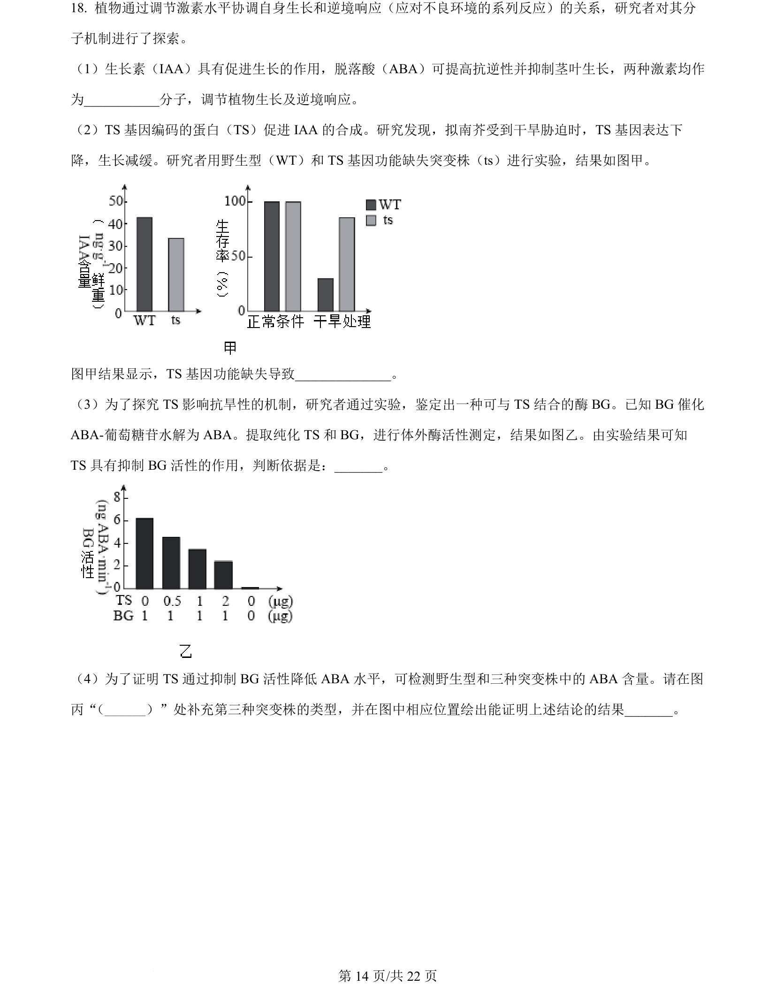
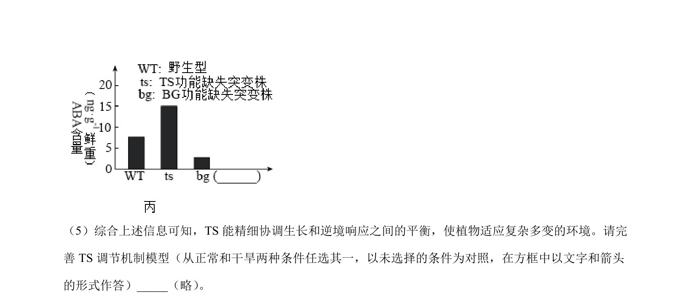
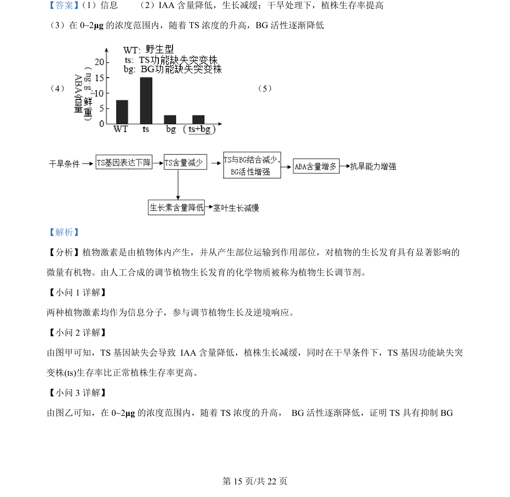
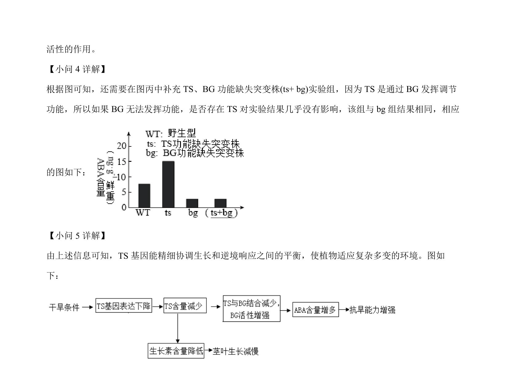

## 题面

## 摘要

考查植物激素调节、TS基因功能及PCR鉴定气味受体基因与嗅觉信号放大机制。

## 关联考点

- [[345-植物激素|植物激素]]
- [[信息分子]]
- [[基因功能]]
- [[410-PCR|PCR]]
- [[信号转导]]

## 答案与解析

> 📄 原 PDF 第 14 页：`素材/真题/北京/2008-2024·（北京）生物高考真题/2024年高考生物试卷（北京）（解析卷）.pdf`
