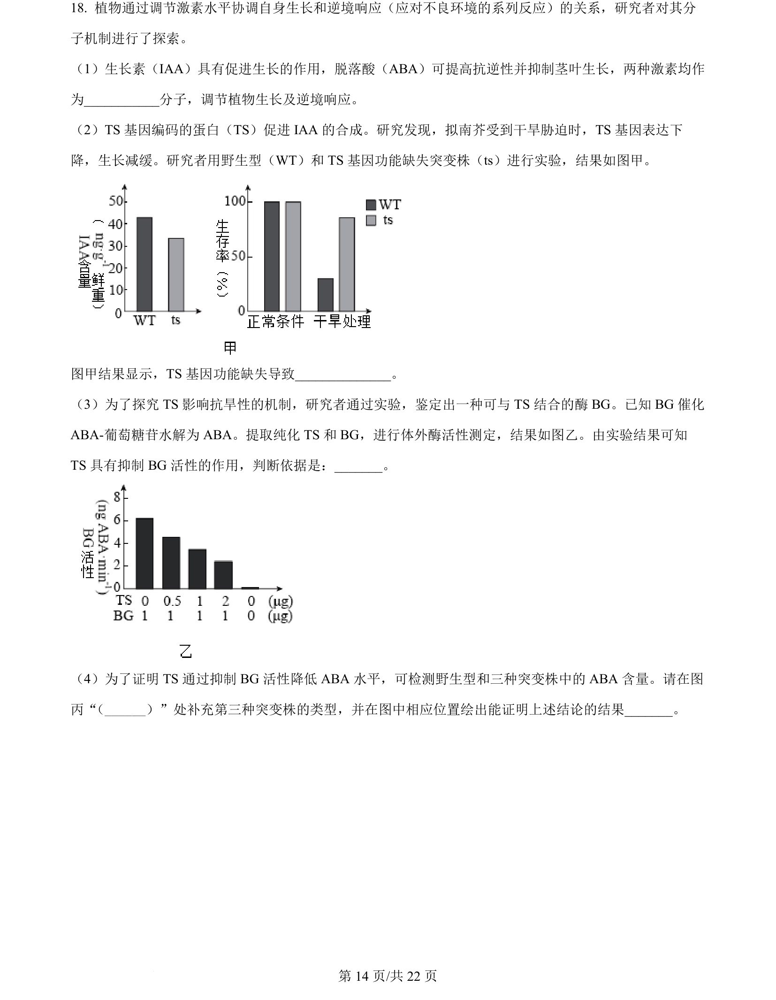
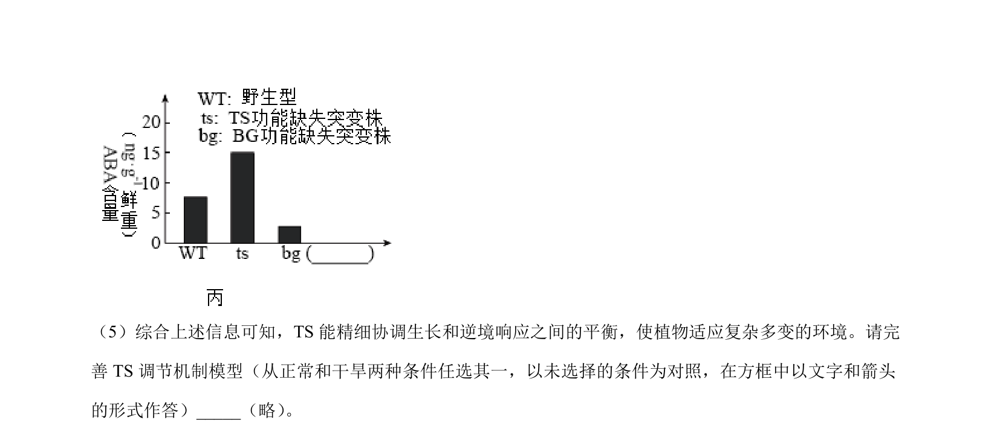
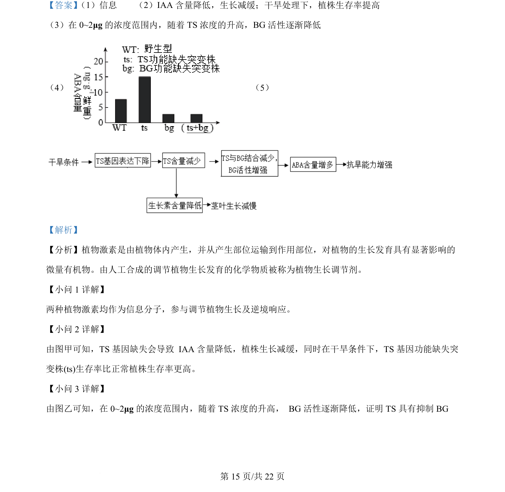
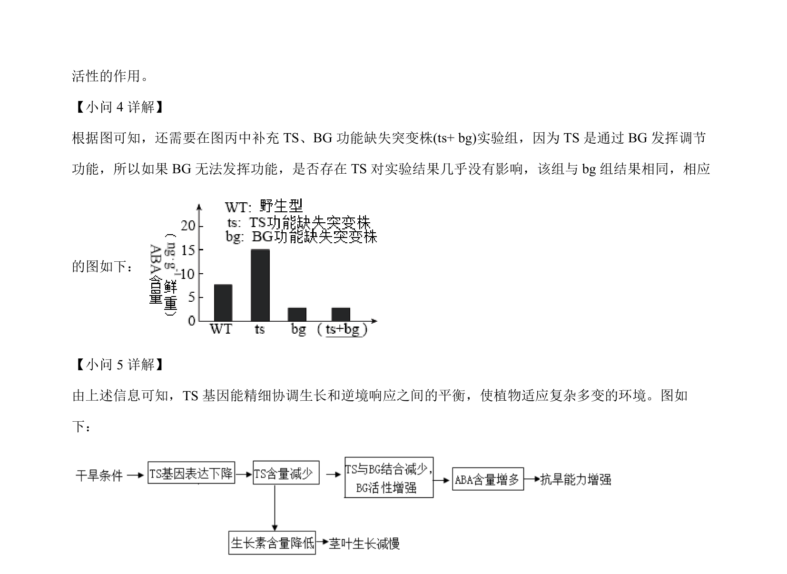

## 题面

## 摘要

考查植物激素调节、TS基因功能及PCR鉴定气味受体基因与嗅觉信号放大机制。

## 关联考点

- [[345-植物激素|植物激素]]
- [[信息分子]]
- [[基因功能]]
- [[410-PCR|PCR]]
- [[信号转导]]

## 答案与解析

> 📄 原 PDF 第 14 页：`素材/真题/北京/2008-2024·（北京）生物高考真题/2024年高考生物试卷（北京）（解析卷）.pdf`

<!-- 题干文本-start -->
## 题干文本
18. 植物通过调节激素水平协调自身生长和逆境响应（应对不良环境的系列反应）的关系，研究者对其分
子机制进行了探索。
（1）生长素（IAA）具有促进生长的作用，脱落酸（ABA）可提高抗逆性并抑制茎叶生长，两种激素均作
为___________分子，调节植物生长及逆境响应。
（2）TS基因编码的蛋白（TS）促进 IAA 的合成。研究发现，拟南芥受到干旱胁迫时，TS基因表达下
降，生长减缓。研究者用野生型（WT）和 TS基因功能缺失突变株（ts）进行实验，结果如图甲。
  
图甲结果显示，TS基因功能缺失导致______________。
（3）为了探究 TS影响抗旱性的机制，研究者通过实验，鉴定出一种可与 TS结合的酶 BG。已知 BG 催化
ABA-葡萄糖苷水解为 ABA。提取纯化 TS和 BG，进行体外酶活性测定，结果如图乙。由实验结果可知
TS具有抑制 BG 活性的作用，判断依据是：_______。
  
（4）为了证明 TS通过抑制 BG 活性降低 ABA 水平，可检测野生型和三种突变株中的 ABA 含量。请在图
丙“（______）”处补充第三种突变株的类型，并在图中相应位置绘出能证明上述结论的结果_______。
<!-- 题干文本-end -->

<!-- 解析文本-start -->
## 解析文本

<!-- 解析文本-end -->
