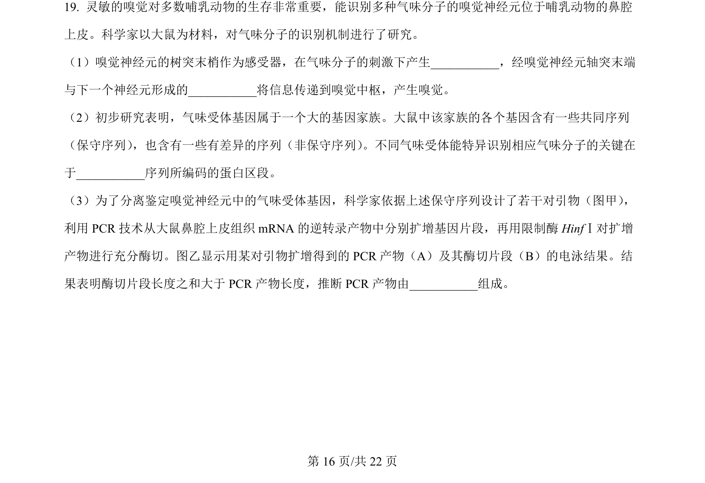
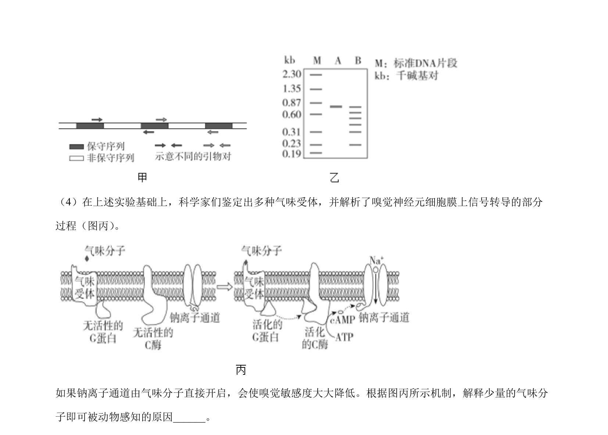
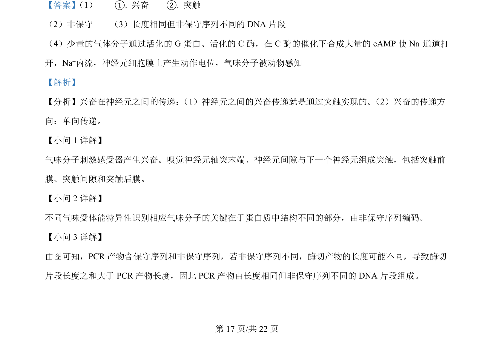
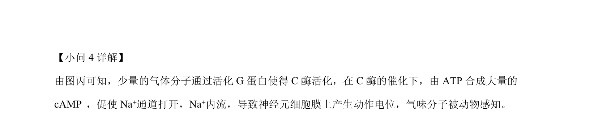

## 题面

## 摘要

该题考查突触结构与兴奋传递、气味受体特异性、PCR产物分析及增强子捕获筛选组织特异表达基因的原理。

## 关联考点

- [[326-突触|突触]]
- [[增强子]]
- [[045-细胞分化|细胞分化]]
- [[581-基因表达调控|基因表达调控]]

## 答案与解析

> 📄 原 PDF 第 16 页：`素材/真题/北京/2008-2024·（北京）生物高考真题/2024年高考生物试卷（北京）（解析卷）.pdf`
