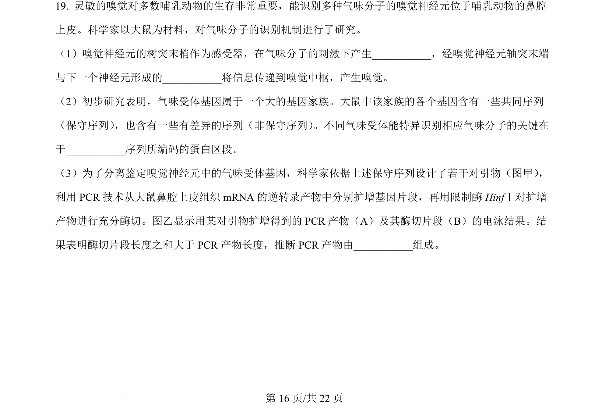
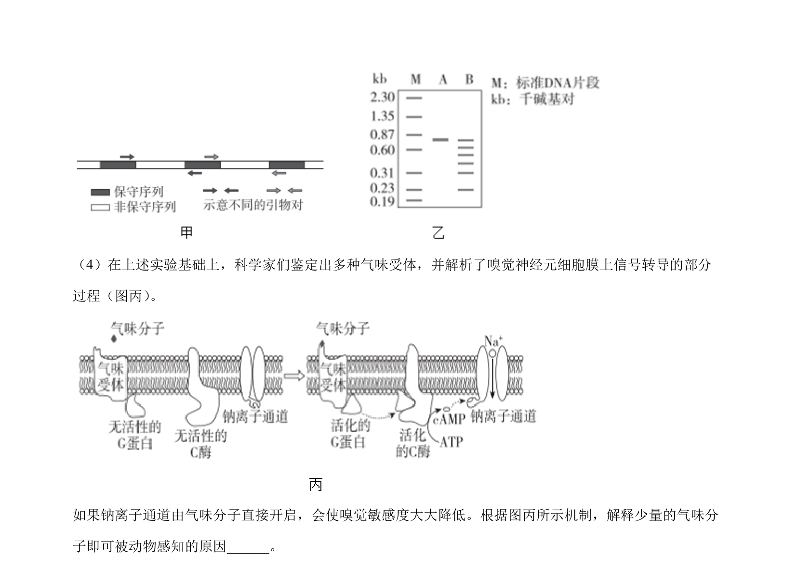
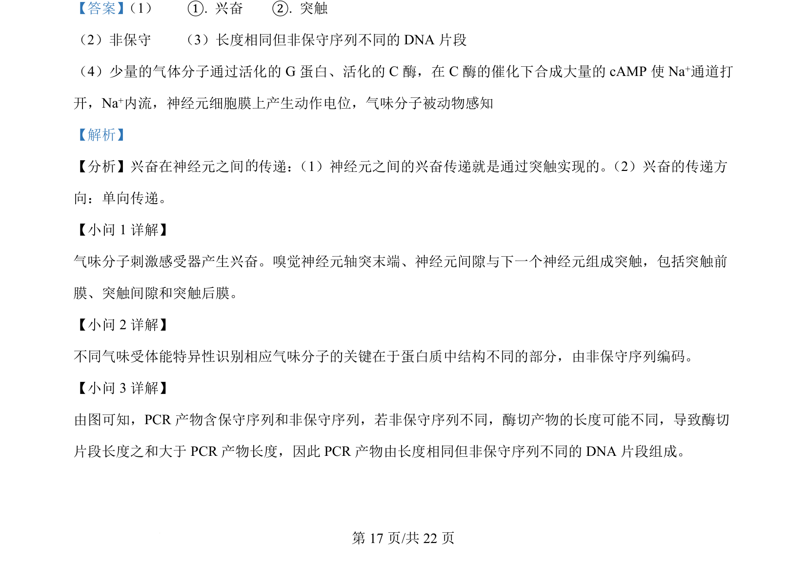
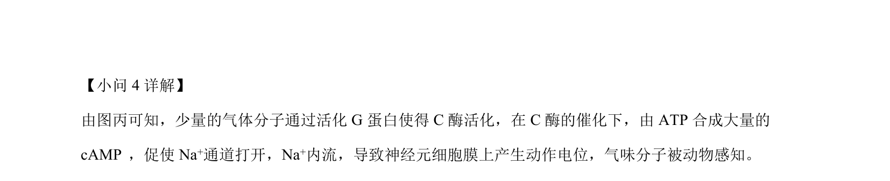

## 题面

## 摘要

该题考查突触结构与兴奋传递、气味受体特异性、PCR产物分析及增强子捕获筛选组织特异表达基因的原理。

## 关联考点

- [[326-突触|突触]]
- [[890-增强子|增强子]]
- [[045-细胞分化|细胞分化]]
- [[581-基因表达调控|基因表达调控]]

## 答案与解析

> 📄 原 PDF 第 16 页：`素材/真题/北京/2008-2024·（北京）生物高考真题/2024年高考生物试卷（北京）（解析卷）.pdf`

<!-- 题干文本-start -->
## 题干文本
19. 灵敏的嗅觉对多数哺乳动物的生存非常重要，能识别多种气味分子的嗅觉神经元位于哺乳动物的鼻腔
上皮。科学家以大鼠为材料，对气味分子的识别机制进行了研究。
（1）嗅觉神经元的树突末梢作为感受器，在气味分子的刺激下产生___________，经嗅觉神经元轴突末端
与下一个神经元形成的___________将信息传递到嗅觉中枢，产生嗅觉。
（2）初步研究表明，气味受体基因属于一个大的基因家族。大鼠中该家族的各个基因含有一些共同序列
（保守序列） ，也含有一些有差异的序列（非保守序列） 。不同气味受体能特异识别相应气味分子的关键在
于___________序列所编码的蛋白区段。
（3）为了分离鉴定嗅觉神经元中的气味受体基因，科学家依据上述保守序列设计了若干对引物（图甲） ，
利用 PCR 技术从大鼠鼻腔上皮组织 mRNA 的逆转录产物中分别扩增基因片段，再用限制酶 HinfⅠ对扩增
产物进行充分酶切。图乙显示用某对引物扩增得到的 PCR 产物（A）及其酶切片段（B）的电泳结果。结
果表明酶切片段长度之和大于 PCR 产物长度，推断 PCR 产物由___________组成。
<!-- 题干文本-end -->

<!-- 解析文本-start -->
## 解析文本

<!-- 解析文本-end -->
