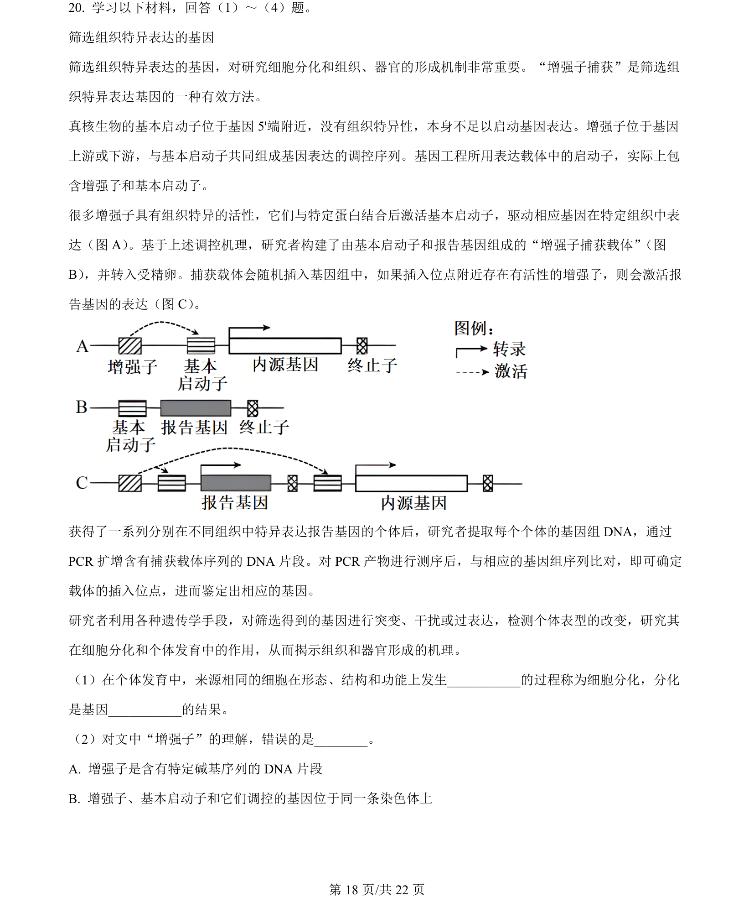
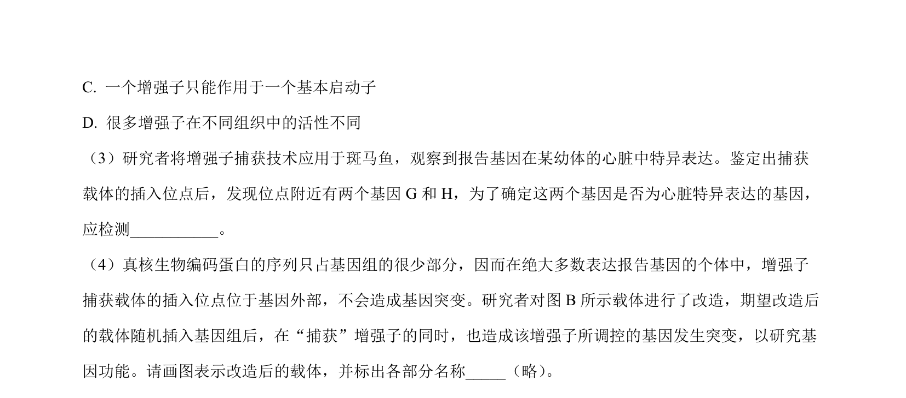
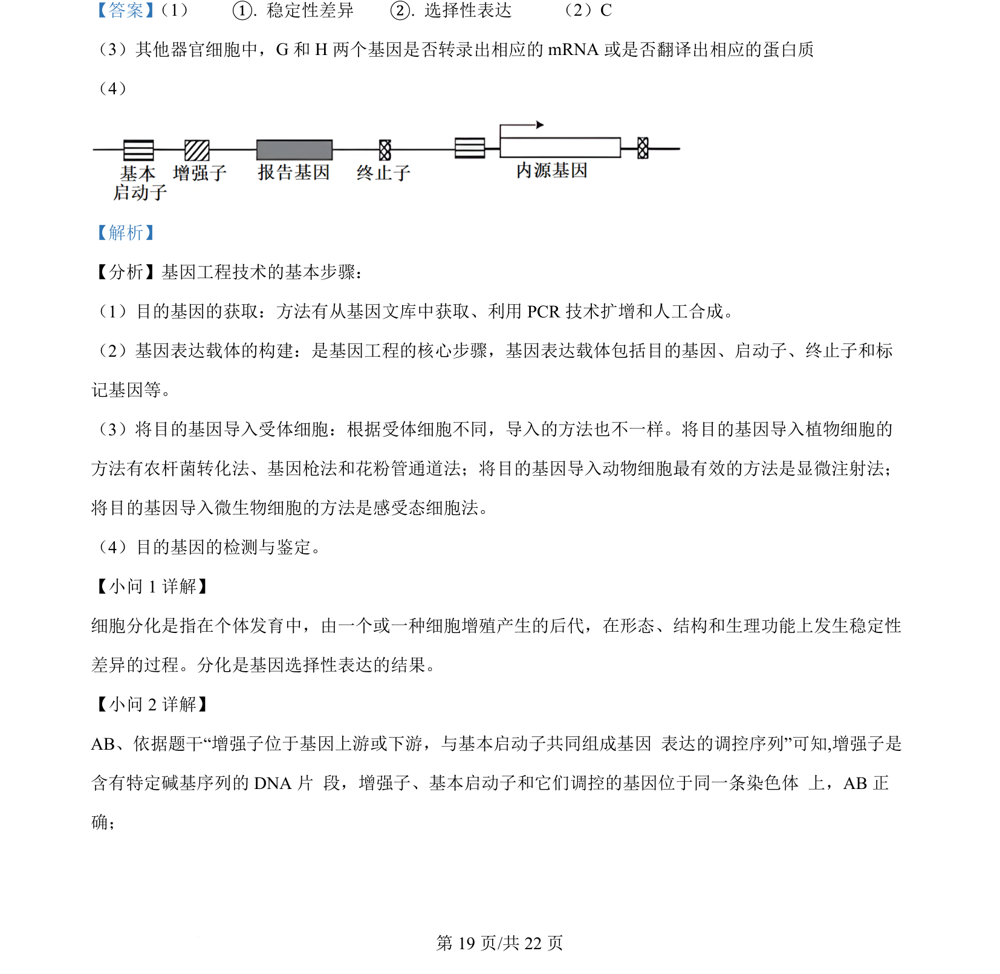
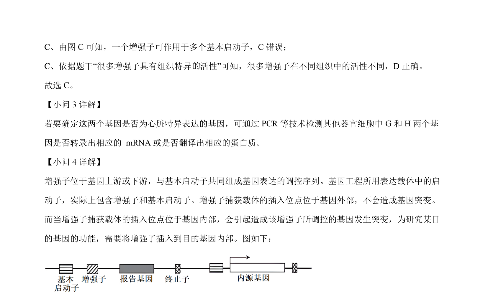

## 题面

## 摘要

本题通过增强子调控及玉米遗传实验，考查基因表达调控与籽粒大小遗传机制。

## 关联考点

- [[增强子]]
- [[750-启动子|启动子]]
- [[525-DNA甲基化|DNA甲基化]]
- [[遗传杂交实验]]

## 答案与解析

> 📄 原 PDF 第 18 页：`素材/真题/北京/2008-2024·（北京）生物高考真题/2024年高考生物试卷（北京）（解析卷）.pdf`
