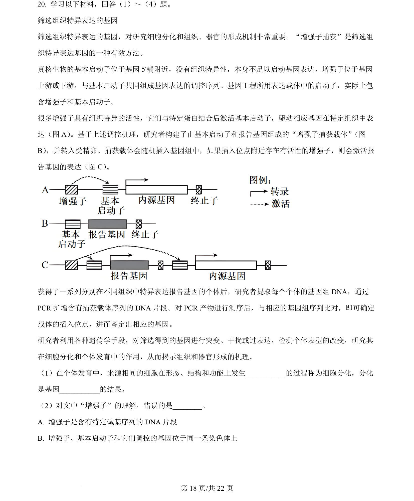
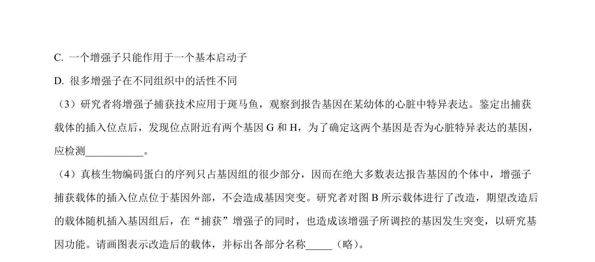
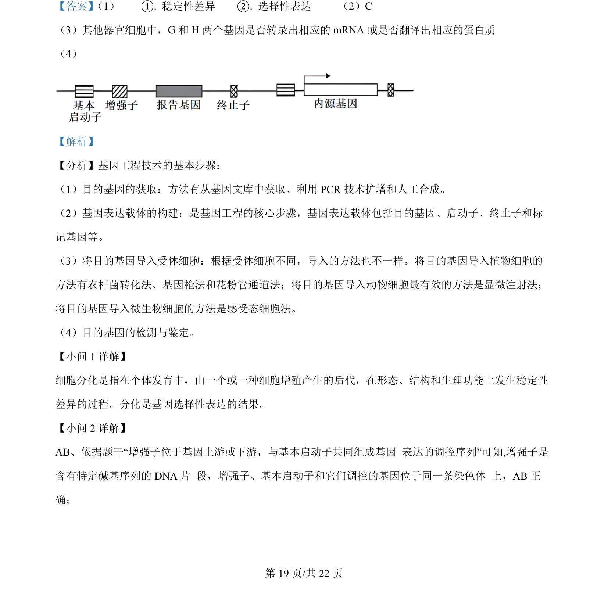
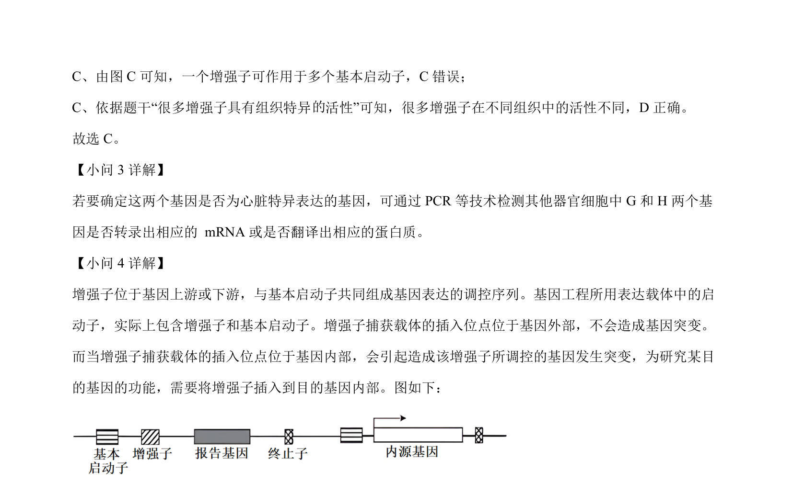

## 题面

## 摘要

本题通过增强子调控及玉米遗传实验，考查基因表达调控与籽粒大小遗传机制。

## 关联考点

- [[890-增强子|增强子]]
- [[750-启动子|启动子]]
- [[525-DNA甲基化|DNA甲基化]]
- [[遗传杂交实验]]

## 答案与解析

> 📄 原 PDF 第 18 页：`素材/真题/北京/2008-2024·（北京）生物高考真题/2024年高考生物试卷（北京）（解析卷）.pdf`

<!-- 题干文本-start -->
## 题干文本
20. 学习以下材料，回答（1）～（4）题。
筛选组织特异表达的基因
筛选组织特异表达的基因，对研究细胞分化和组织、器官的形成机制非常重要。“增强子捕获”是筛选组
织特异表达基因的一种有效方法。
真核生物的基本启动子位于基因 5'端附近，没有组织特异性，本身不足以启动基因表达。增强子位于基因
上游或下游，与基本启动子共同组成基因表达的调控序列。基因工程所用表达载体中的启动子，实际上包
含增强子和基本启动子。
很多增强子具有组织特异的活性，它们与特定蛋白结合后激活基本启动子，驱动相应基因在特定组织中表
达（图 A） 。基于上述调控机理，研究者构建了由基本启动子和报告基因组成的“增强子捕获载体”（图
B） ，并转入受精卵。捕获载体会随机插入基因组中，如果插入位点附近存在有活性的增强子，则会激活报
告基因的表达（图 C） 。
获得了一系列分别在不同组织中特异表达报告基因的个体后，研究者提取每个个体的基因组 DNA，通过
PCR 扩增含有捕获载体序列的 DNA 片段。对 PCR 产物进行测序后，与相应的基因组序列比对，即可确定
载体的插入位点，进而鉴定出相应的基因。
研究者利用各种遗传学手段，对筛选得到的基因进行突变、干扰或过表达，检测个体表型的改变，研究其
在细胞分化和个体发育中的作用，从而揭示组织和器官形成的机理。
（1）在个体发育中，来源相同的细胞在形态、结构和功能上发生___________的过程称为细胞分化，分化
是基因___________的结果。
（2）对文中“增强子”的理解，错误的是________。
A. 增强子是含有特定碱基序列的 DNA 片段
B. 增强子、基本启动子和它们调控的基因位于同一条染色体上
<!-- 题干文本-end -->

<!-- 解析文本-start -->
## 解析文本

<!-- 解析文本-end -->
