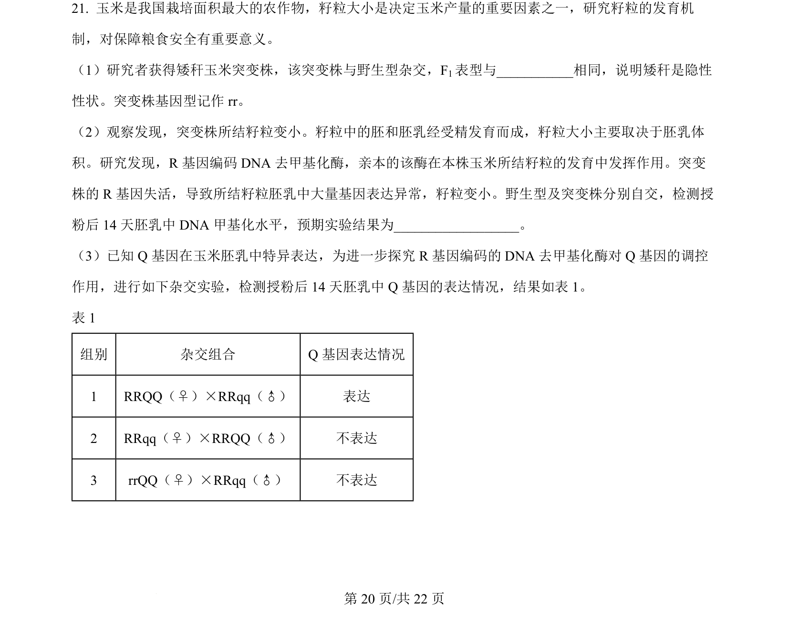
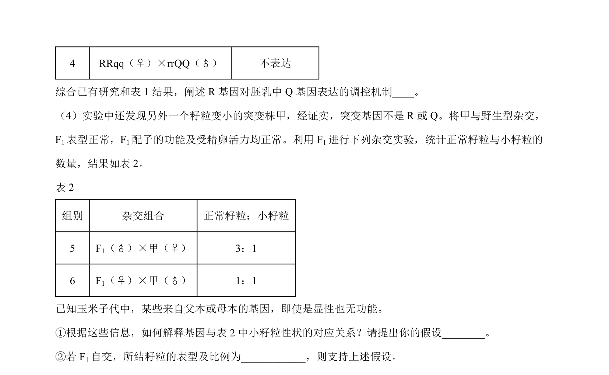
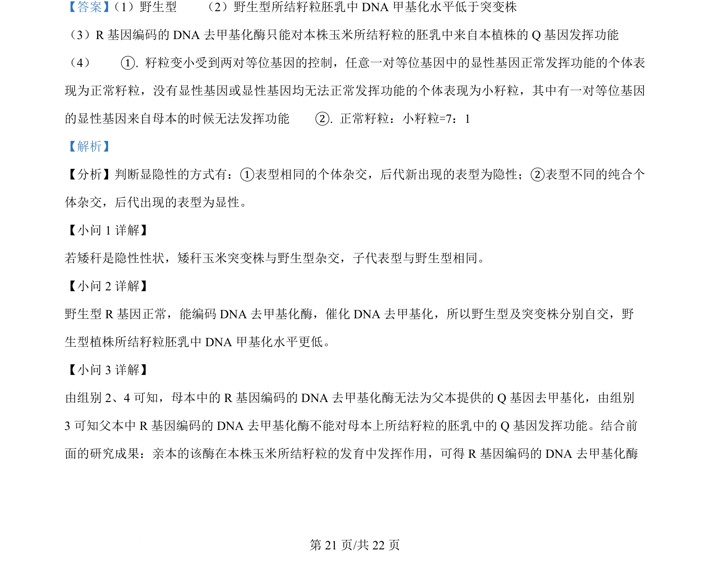
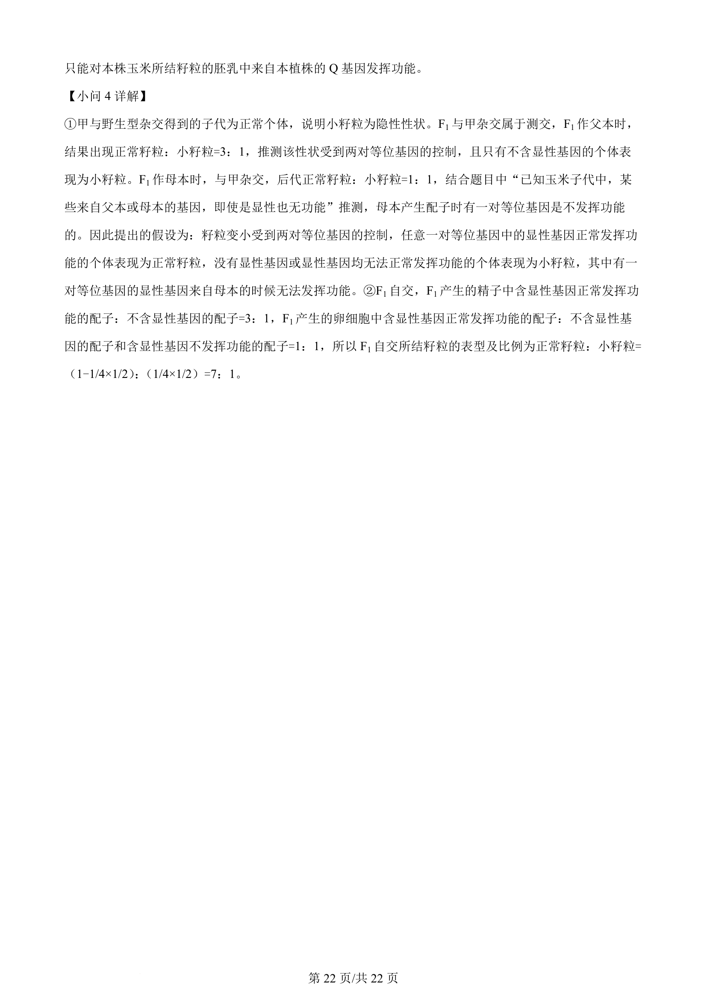

## 题面

## 摘要

该题考查玉米籽粒性状的遗传规律，涉及显隐性判断、基因甲基化、遗传实验分析及基因表达调控。

## 关联考点

- [[基因的分离定律和自由组合定律]]
- [[491-显隐性性状判断|显隐性性状判断]]
- [[DNA甲基化与基因表达调控]]
- [[遗传实验设计与推理]]

## 答案与解析

> 📄 原 PDF 第 20 页：`素材/真题/北京/2008-2024·（北京）生物高考真题/2024年高考生物试卷（北京）（解析卷）.pdf`
