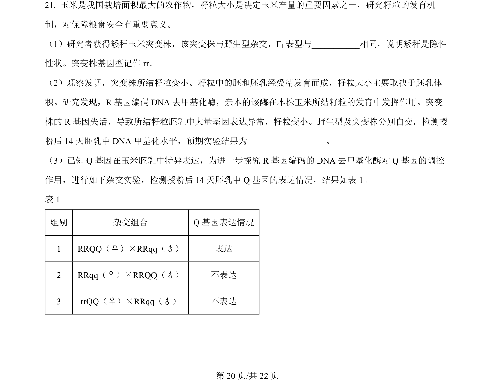
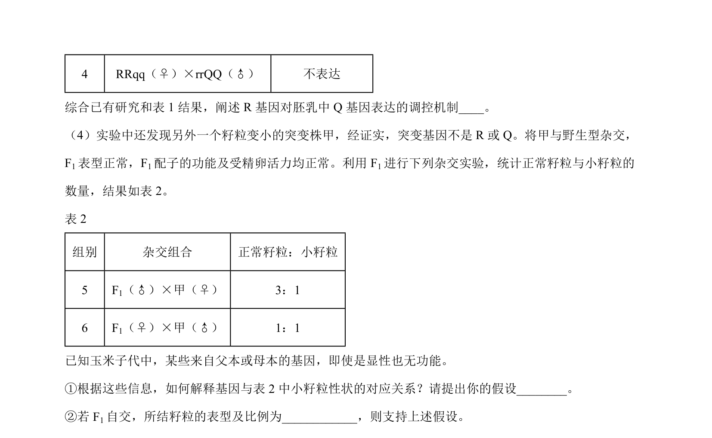
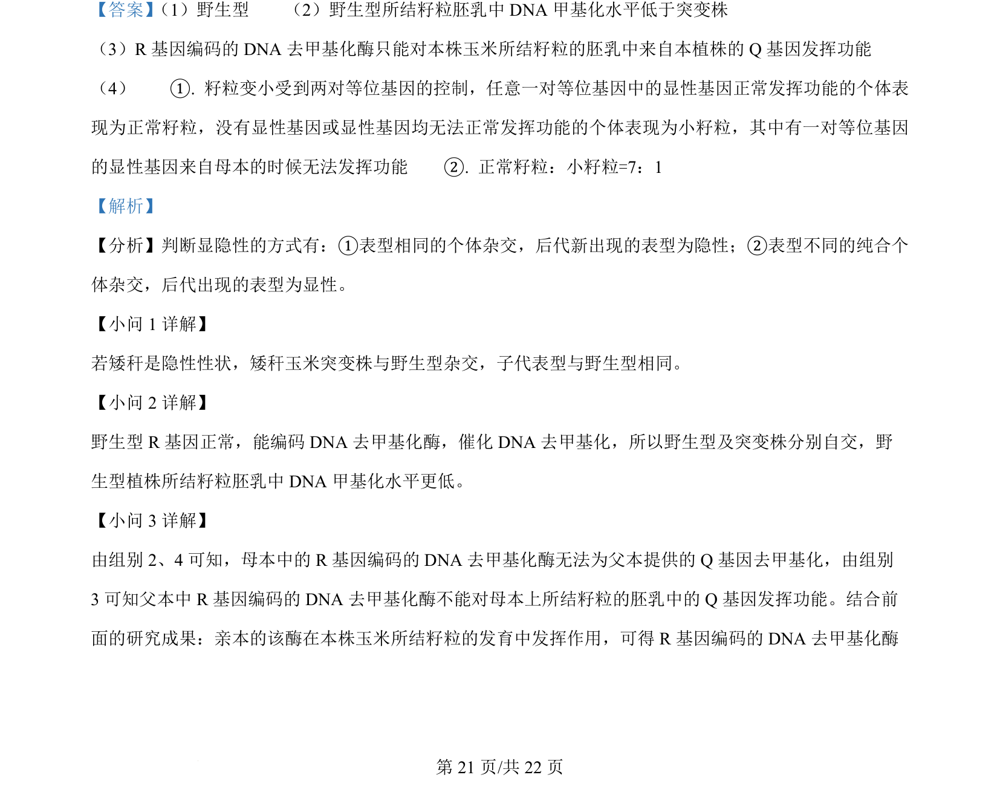
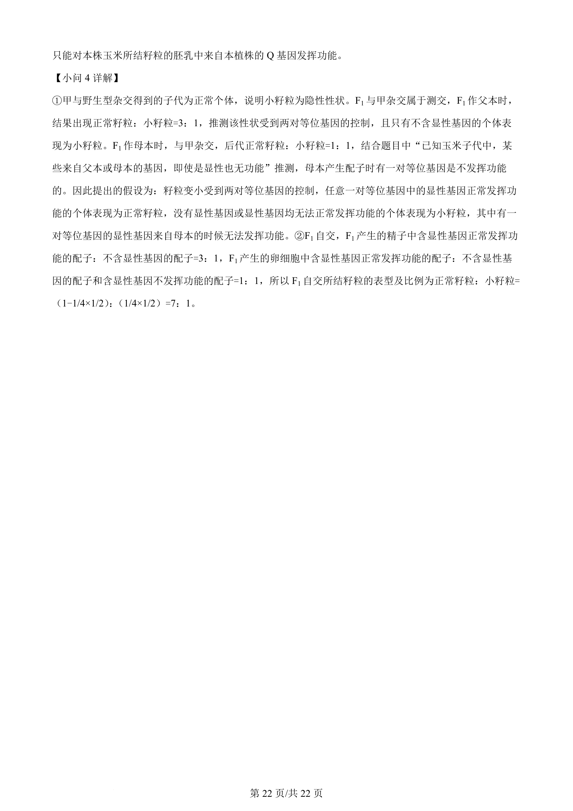

## 题面

## 摘要

该题考查玉米籽粒性状的遗传规律，涉及显隐性判断、基因甲基化、遗传实验分析及基因表达调控。

## 关联考点

- [[基因的分离定律和自由组合定律]]
- [[491-显隐性性状判断|显隐性性状判断]]
- [[DNA甲基化与基因表达调控]]
- [[遗传实验设计与推理]]

## 答案与解析

> 📄 原 PDF 第 20 页：`素材/真题/北京/2008-2024·（北京）生物高考真题/2024年高考生物试卷（北京）（解析卷）.pdf`

<!-- 题干文本-start -->
## 题干文本
21. 玉米是我国栽培面积最大的农作物，籽粒大小是决定玉米产量的重要因素之一，研究籽粒的发育机
制，对保障粮食安全有重要意义。
（1）研究者获得矮秆玉米突变株，该突变株与野生型杂交，F1表型与___________相同，说明矮秆是隐性
性状。突变株基因型记作 rr。
（2）观察发现，突变株所结籽粒变小。籽粒中的胚和胚乳经受精发育而成，籽粒大小主要取决于胚乳体
积。研究发现，R基因编码 DNA 去甲基化酶，亲本的该酶在本株玉米所结籽粒的发育中发挥作用。突变
株的 R基因失活，导致所结籽粒胚乳中大量基因表达异常，籽粒变小。野生型及突变株分别自交，检测授
粉后 14 天胚乳中 DNA 甲基化水平，预期实验结果为__________________。
（3）已知 Q 基因在玉米胚乳中特异表达，为进一步探究 R基因编码的 DNA 去甲基化酶对 Q 基因的调控
作用，进行如下杂交实验，检测授粉后 14 天胚乳中 Q 基因的表达情况，结果如表 1。
表 1
组别 杂交组合 Q 基因表达情况
1 RRQQ（♀）×RRqq（♂） 表达
2 RRqq（♀）×RRQQ（♂） 不表达
3 rrQQ（♀）×RRqq（♂） 不表达
的
<!-- 题干文本-end -->

<!-- 解析文本-start -->
## 解析文本

<!-- 解析文本-end -->
