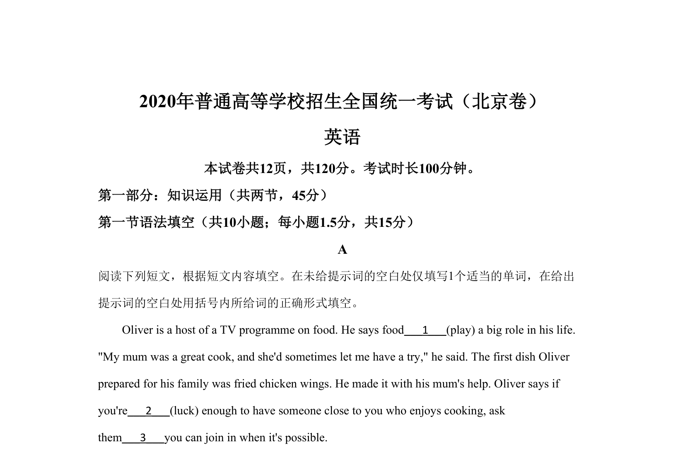
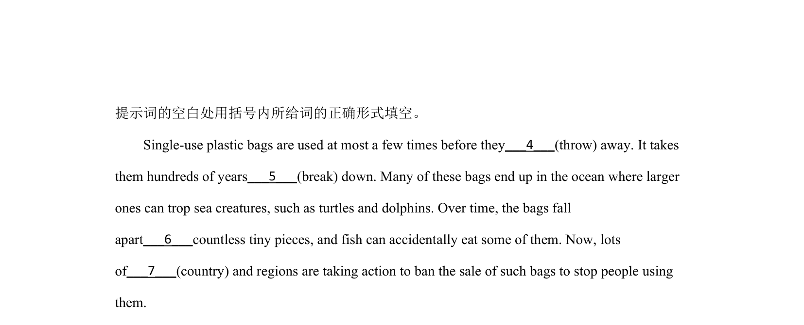

## 篇章题面

## 摘要

【分析】本文是记叙文，主要介绍了美食节目主持人奥利弗。

## 关联考点

- [[1032-阅读表达|阅读表达]]
- [[1030-信息归纳|信息归纳]]

## 答案

`1. plays/has played/is playing/has been playing 2. lucky 3. if/whether`

## 解析

> 📄 原 PDF 第 1 页：`素材/真题/北京/2008-2024·（北京）英语高考真题/2020年高考英语试卷（北京）（机考 无听力）（解析卷）.pdf`
