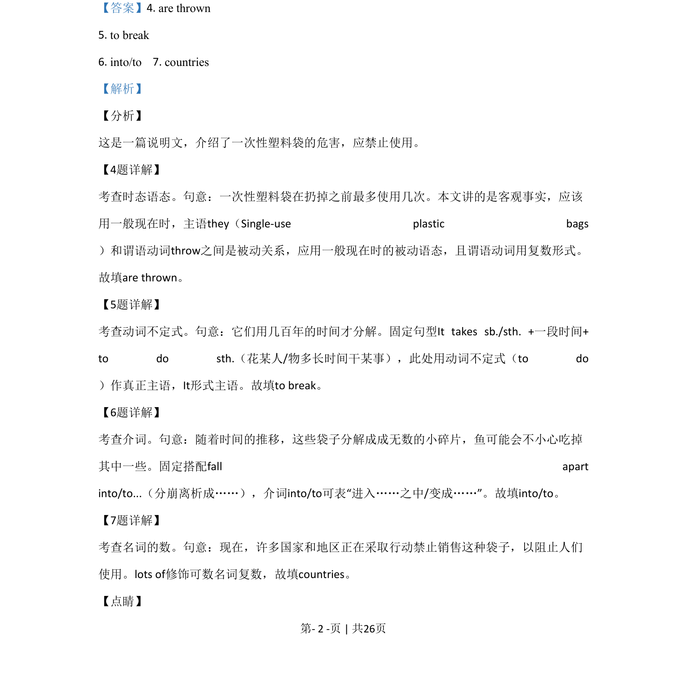
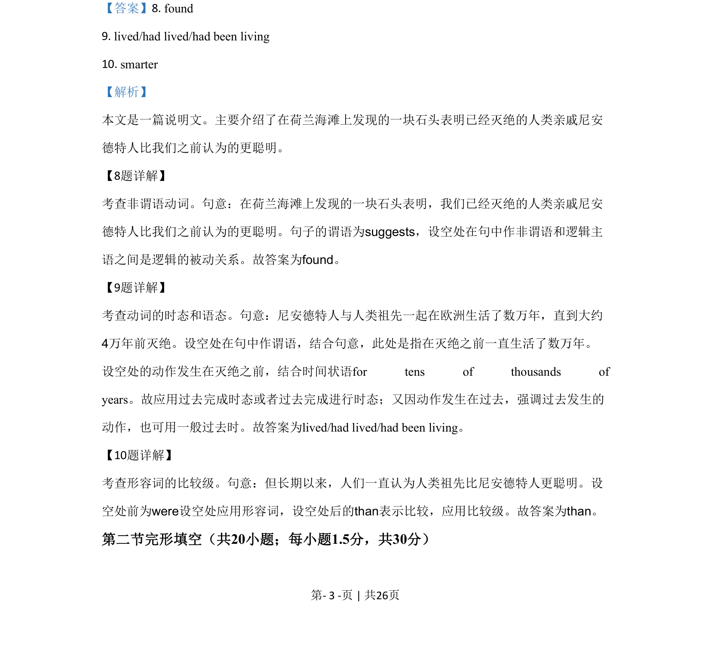
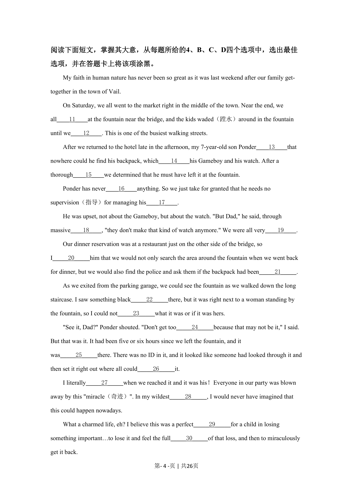
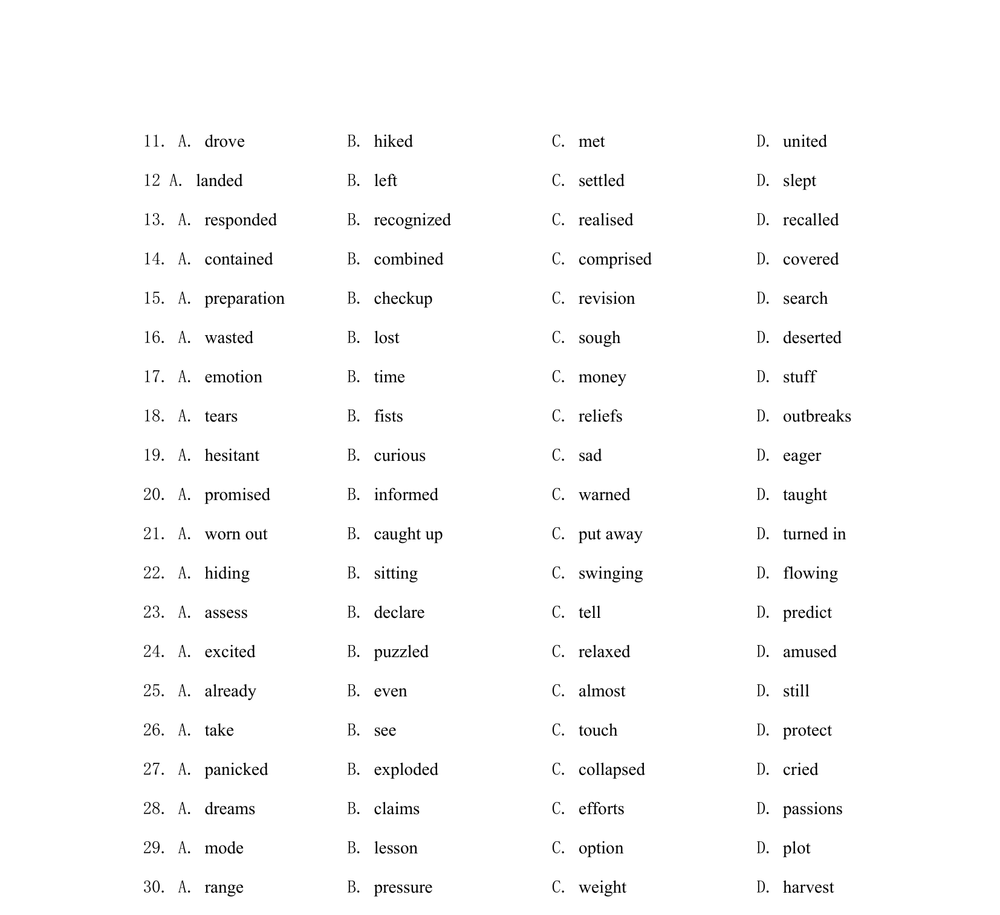

## 篇章题面

## 摘要

本文是一篇说明文。主要介绍了在荷兰海滩上发现的一块石头表明已经灭绝的人类亲戚尼安 德特人比我们之前认为的更聪明。

## 关联考点

- [[1032-阅读表达|阅读表达]]
- [[1030-信息归纳|信息归纳]]
- [[550-说明文|说明文]]

## 答案

`8. found 9. lived/had lived/had been living 10. smarter`

## 解析

> 📄 原 PDF 第 3 页：`素材/真题/北京/2008-2024·（北京）英语高考真题/2020年高考英语试卷（北京）（机考 无听力）（解析卷）.pdf`
