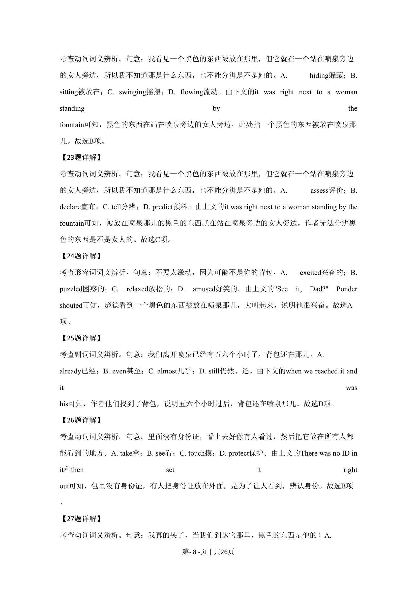

## 篇章题面

## 摘要

这是一篇记叙文。文章讲述了作者儿子丢失背包，五六个小时过后，背包在丢失的地方被找 到了，这让作者真正意识到了人性信仰的伟大。

## 关联考点

- [[1031-语篇填空|语篇填空]]
- [[1018-语法填空|语法填空]]

## 答案

`11. C 12. B 13. C 14. A 15. D 16. B 17. D 18. A 19. C 20. A 21. D 22. B 23. C 24. A 25. D 26. B 27. D 28. A 29. B 30. C`

## 解析

> 📄 原 PDF 第 5 页：`素材/真题/北京/2008-2024·（北京）英语高考真题/2020年高考英语试卷（北京）（机考 无听力）（解析卷）.pdf`
