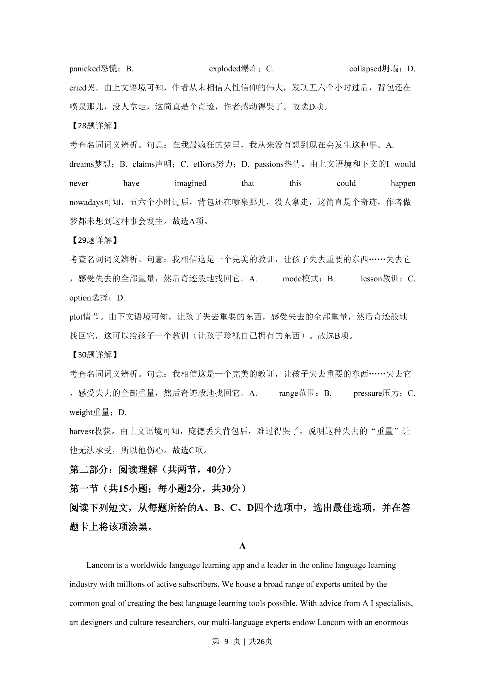
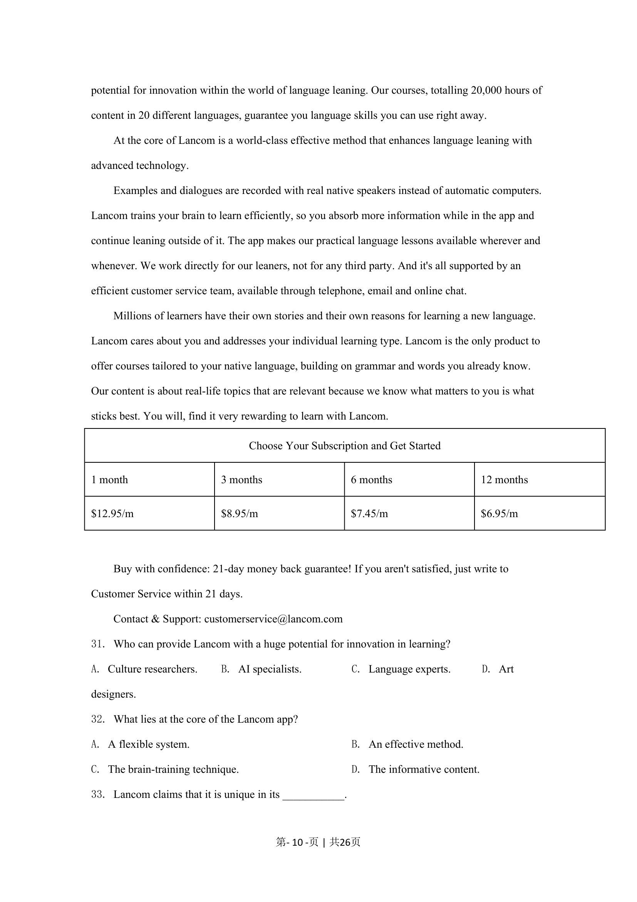
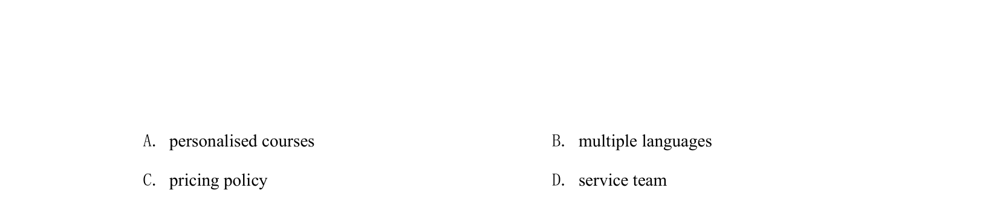

## 篇章题面

## 摘要

这是一篇应用文。文章主要介绍一个名为Lancom的全球性语言学习应用程序，介绍了其特色 、价格以及联系方式等信息。

## 关联考点

- [[725-reading comprehension|阅读理解]]
- [[690-Specific Information|细节理解]]
- [[888-推理判断|推理判断]]

## 答案

`31. C 32. B 33. A`

## 解析

> 📄 原 PDF 第 11 页：`素材/真题/北京/2008-2024·（北京）英语高考真题/2020年高考英语试卷（北京）（机考 无听力）（解析卷）.pdf`
