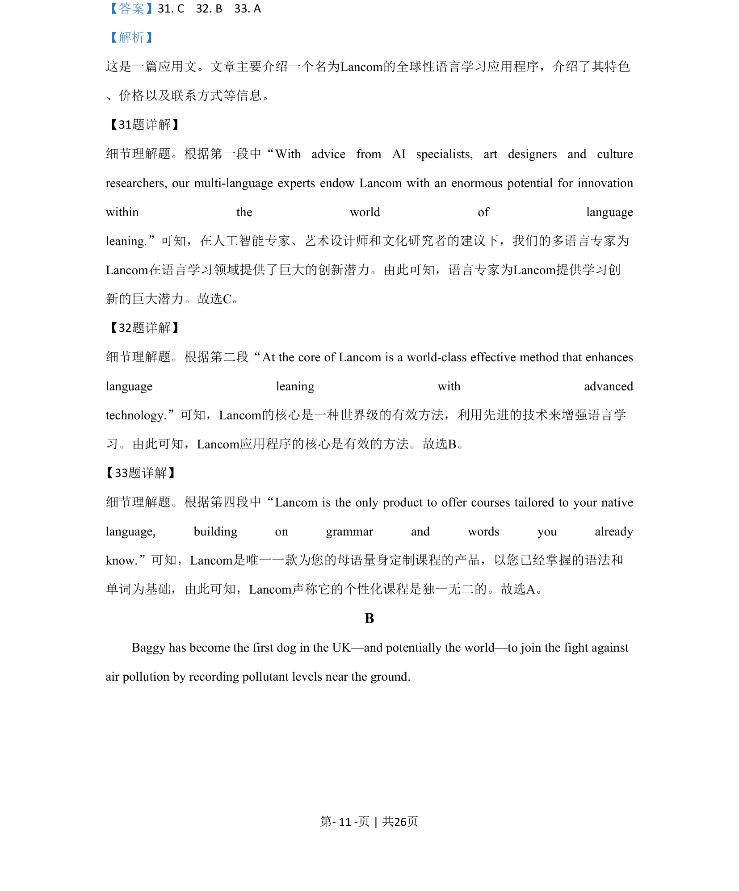
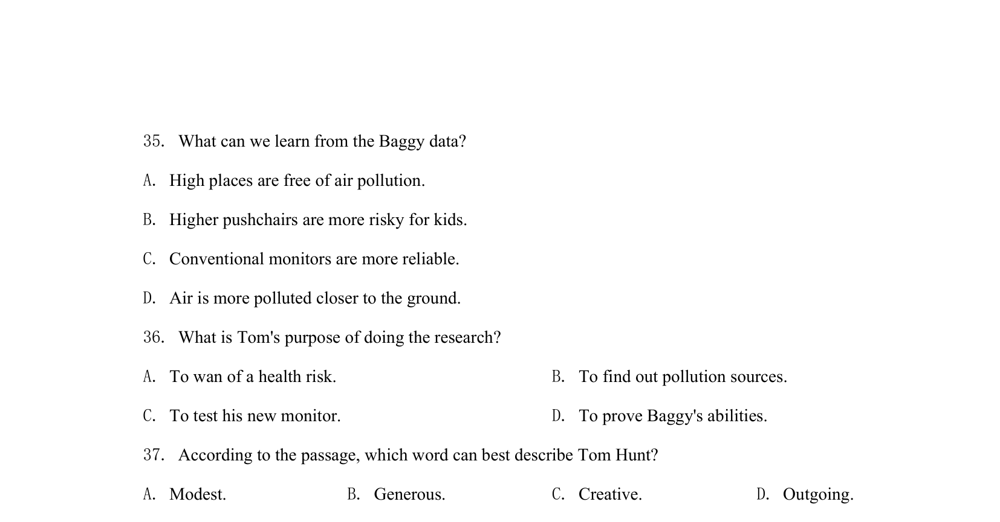
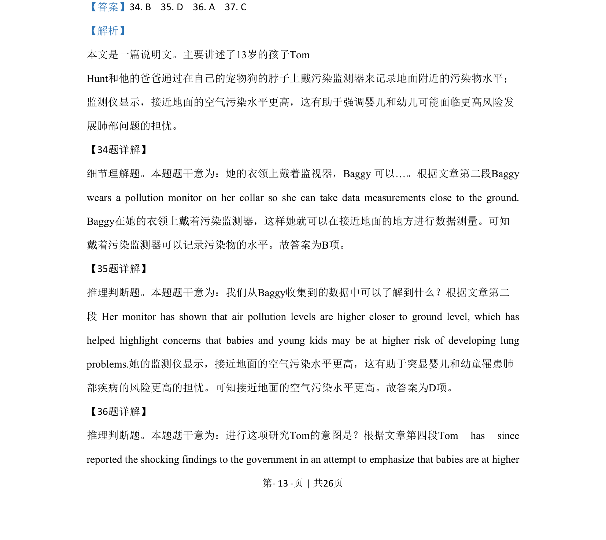
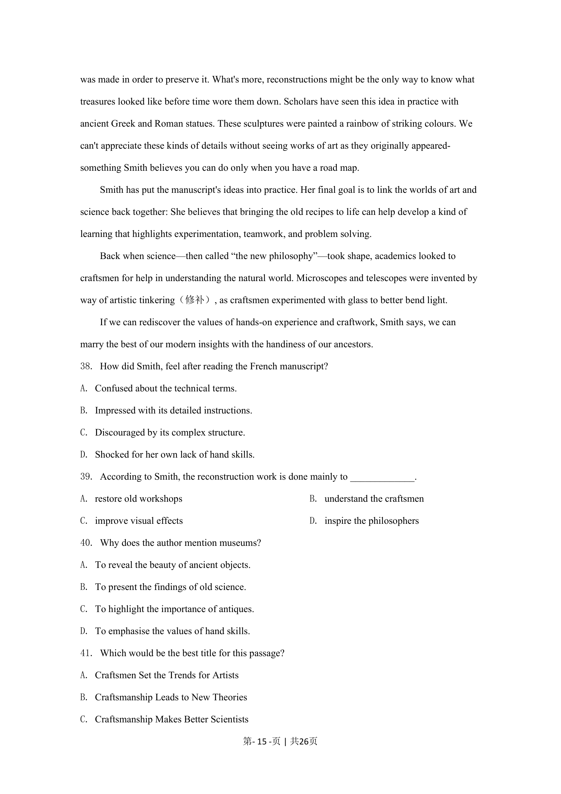
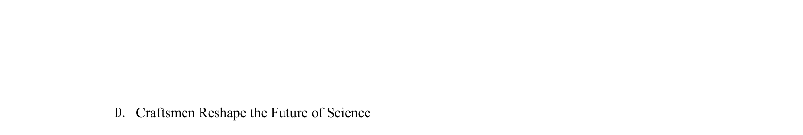

## 篇章题面

## 摘要

本文是一篇说明文。主要讲述了13岁的孩子Tom Hunt和他的爸爸通过在自己的宠物狗的脖子上戴污染监测器来记录地面附近的污染物水平； 监测仪显示，接近地面的空气污染水平更高，这有助于强调婴儿和幼儿可能面临更高风险发 展肺部问题的担忧。

## 关联考点

- [[724-reading comprehension|阅读理解]]
- [[689-Specific Information|细节理解]]
- [[887-推理判断|推理判断]]
- [[550-说明文|说明文]]

## 答案

`34. B 35. D 36. A 37. C`

## 解析

> 📄 原 PDF 第 13 页：`素材/真题/北京/2008-2024·（北京）英语高考真题/2020年高考英语试卷（北京）（机考 无听力）（解析卷）.pdf`
