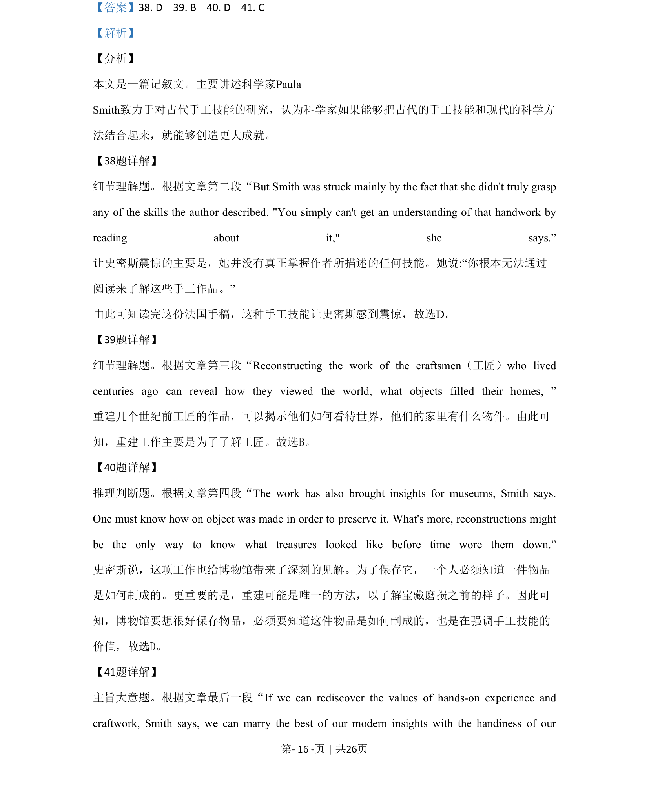
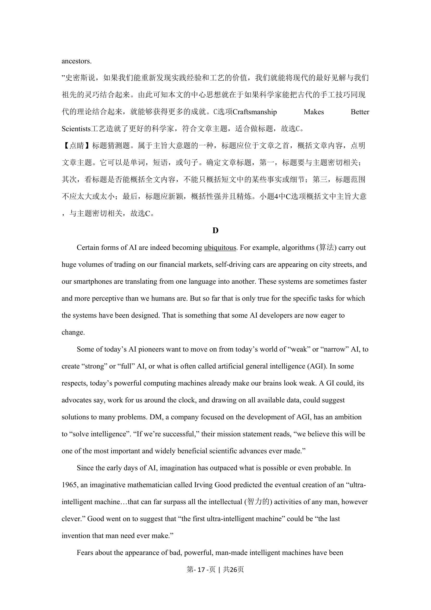

## 篇章题面

## 摘要

这是一篇议论文。文章主要就通用人工智能(AGI)实现的可能性进行了论述。

## 关联考点

- [[724-reading comprehension|阅读理解]]
- [[689-Specific Information|细节理解]]
- [[887-推理判断|推理判断]]

## 答案

`42. D 43. A 44. B 45. A`

## 解析

> 📄 原 PDF 第 18 页：`素材/真题/北京/2008-2024·（北京）英语高考真题/2020年高考英语试卷（北京）（机考 无听力）（解析卷）.pdf`
