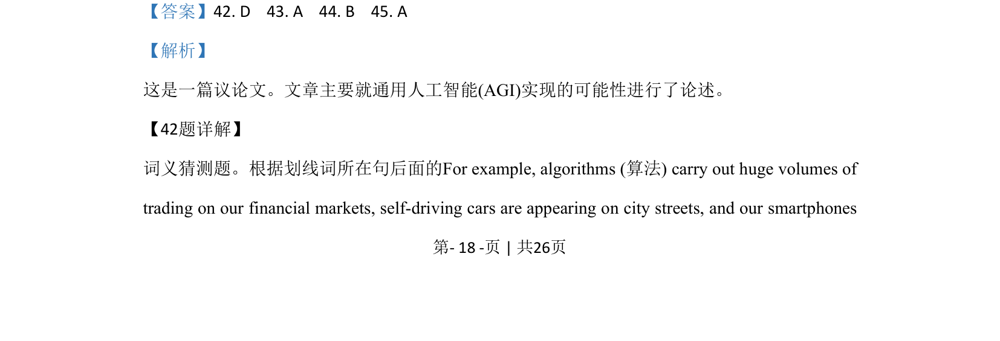
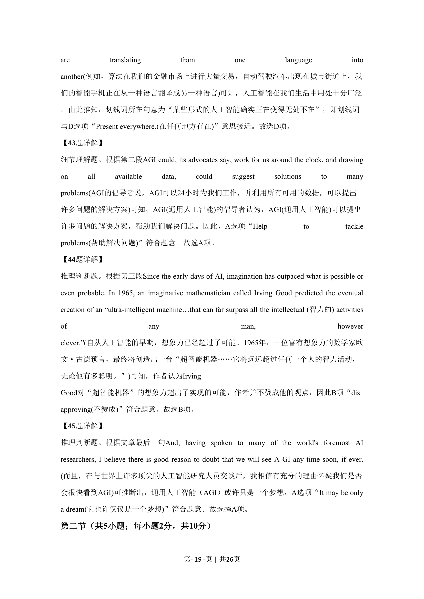
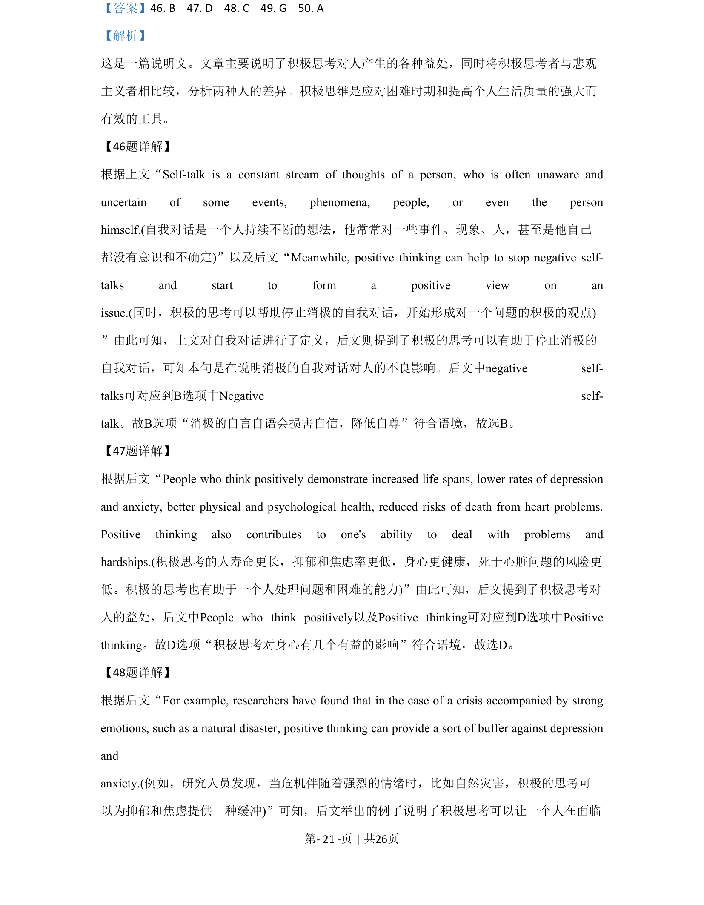
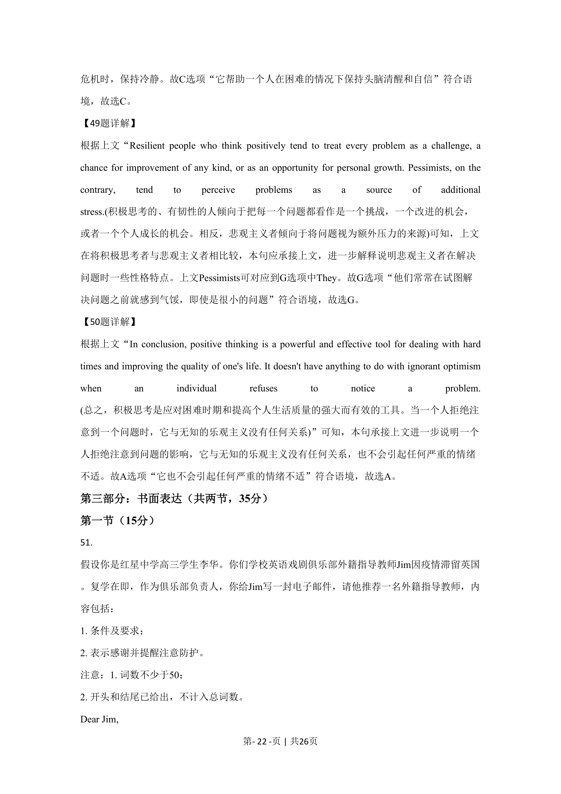

## 篇章题面

## 摘要

这是一篇说明文。文章主要说明了积极思考对人产生的各种益处，同时将积极思考者与悲观 主义者相比较，分析两种人的差异。积极思维是应对困难时期和提高个人生活质量的强大而 有效的工具。

## 关联考点

- [[724-reading comprehension|阅读理解]]
- [[689-Specific Information|细节理解]]
- [[887-推理判断|推理判断]]

## 答案

`46. B 47. D 48. C 49. G 50. A`

## 解析

> 📄 原 PDF 第 21 页：`素材/真题/北京/2008-2024·（北京）英语高考真题/2020年高考英语试卷（北京）（机考 无听力）（解析卷）.pdf`
