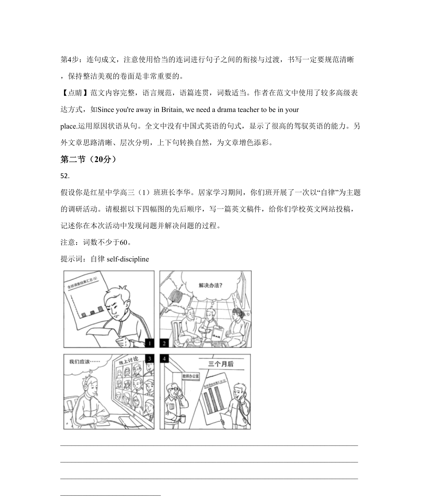

## 篇章题面

## 摘要

【分析】 本篇书面表达是应用文，要求写一封书信。

## 关联考点

- [[996-书面表达|书面表达]]
- [[1007-应用文写作|应用文写作]]

## 答案

`Dear Jim, How are you doing? I hope everything's OK with you. Our school's drama club plans to start practising. Since you're away in Britain, we need a drama teacher to be in your place. Would you please recommend one for us? He or she should be a native English speaker, currently in Beijing, and e`

## 解析

> 📄 原 PDF 第 23 页：`素材/真题/北京/2008-2024·（北京）英语高考真题/2020年高考英语试卷（北京）（机考 无听力）（解析卷）.pdf`
