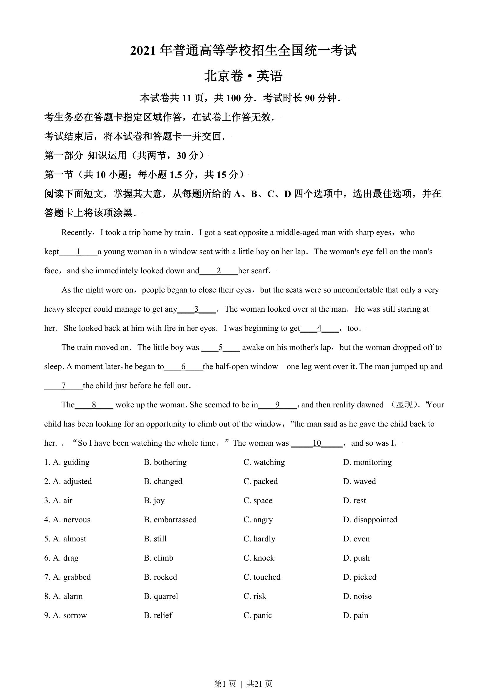
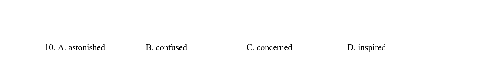
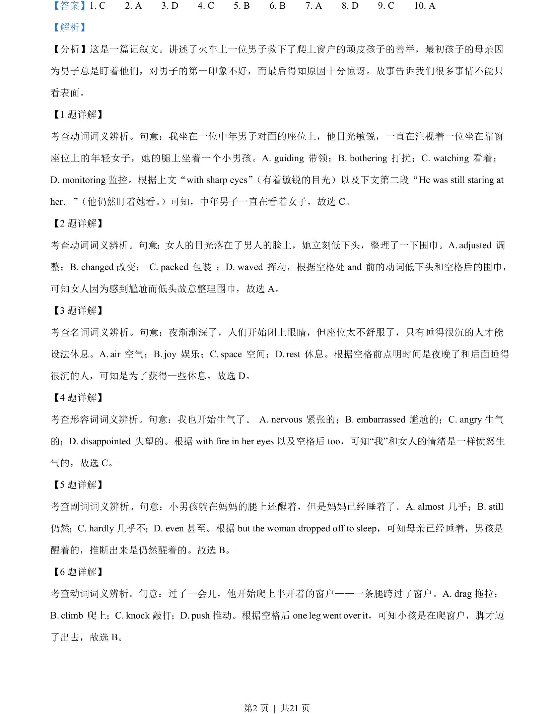
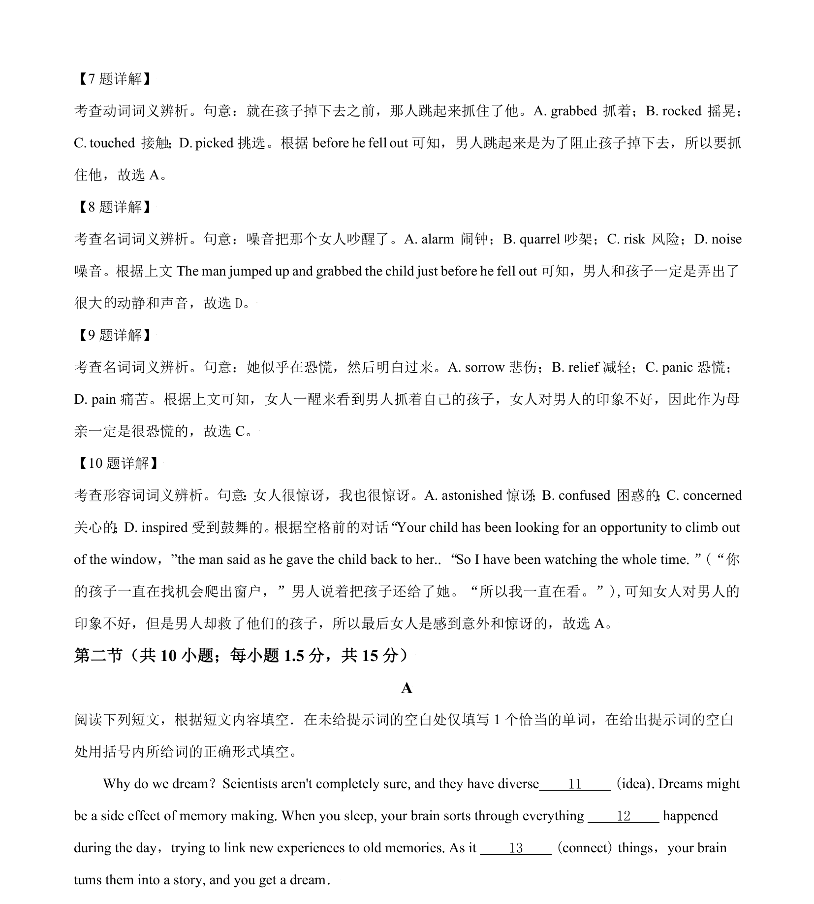

## 篇章题面

## 摘要

【分析】这是一篇记叙文。讲述了火车上一位男子救下了爬上窗户的顽皮孩子的善举，最初孩子的母亲因 为男子总是盯着他们，对男子的第一印象不好，而最后得知原因十分惊讶。故事告诉我们很多事情不能只 看表面。

## 关联考点

- [[810-完形填空|完形填空]]
- [[900-词义辨析|词义辨析]]
- [[908-语境理解|语境理解]]

## 答案

`1. C 2. A 3. D 4. C 5. B 6. B 7. A 8. D 9. C 10. A`

## 解析

> 📄 原 PDF 第 2 页：`素材/真题/北京/2008-2024·（北京）英语高考真题/2021年高考英语试卷（北京）（机考 无听力）（解析卷）.pdf`
