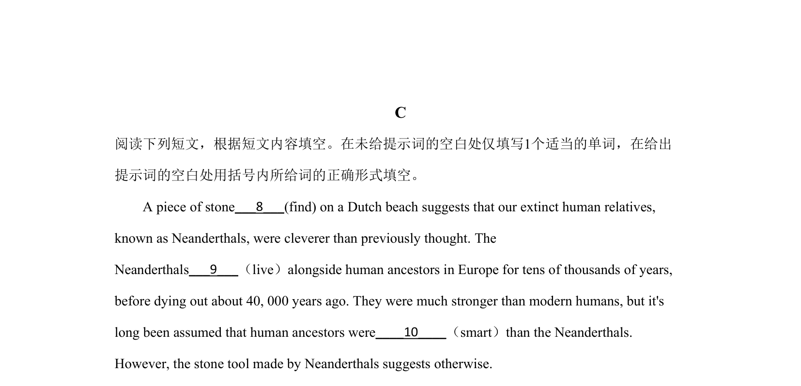

## 篇章题面

## 摘要

【分析】这是一篇说明文。文章解释了我们为什么会做梦的原因。

## 关联考点

- [[1031-语篇填空|语篇填空]]
- [[1018-语法填空|语法填空]]

## 答案

`11. ideas 12. that 13. connects`

## 解析

> 📄 原 PDF 第 3 页：`素材/真题/北京/2008-2024·（北京）英语高考真题/2021年高考英语试卷（北京）（机考 无听力）（解析卷）.pdf`
