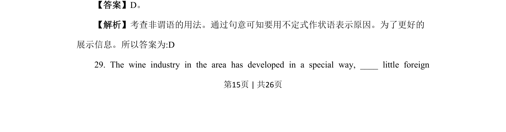
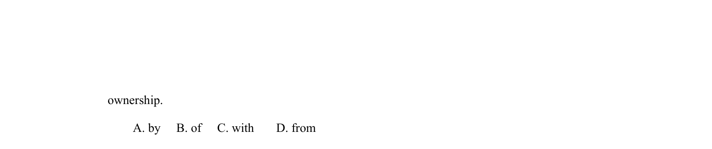
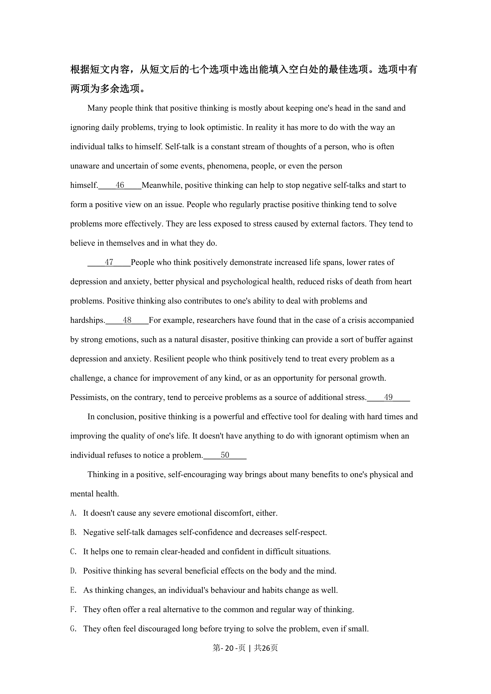
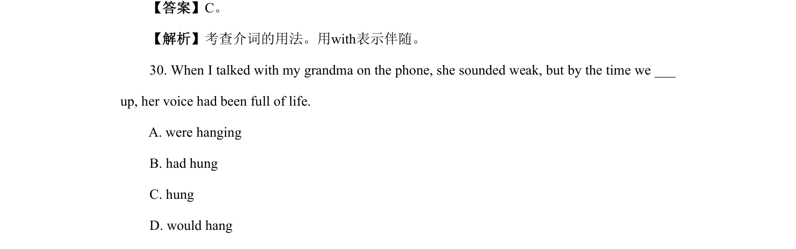
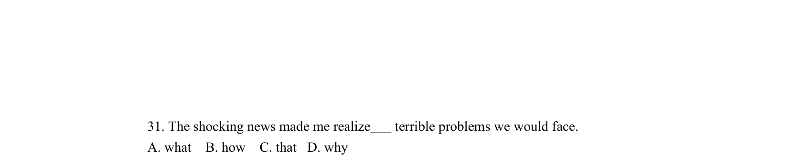
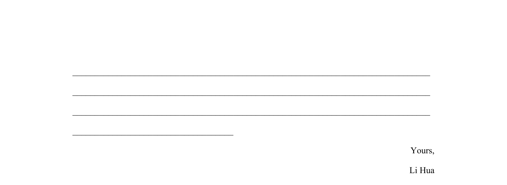

## 篇章题面

## 摘要

【分析】本文是一篇说明文，主要讲的是音乐对身体的好处。

## 关联考点

- [[996-七选五|七选五]]
- [[1016-篇章结构|篇章结构]]
- [[550-说明文|说明文]]

## 答案

`35. F 36. B 37. D 38. G 39. E`

## 解析

> 📄 原 PDF 第 15 页：`素材/真题/北京/2008-2024·（北京）英语高考真题/2021年高考英语试卷（北京）（机考 无听力）（解析卷）.pdf`
