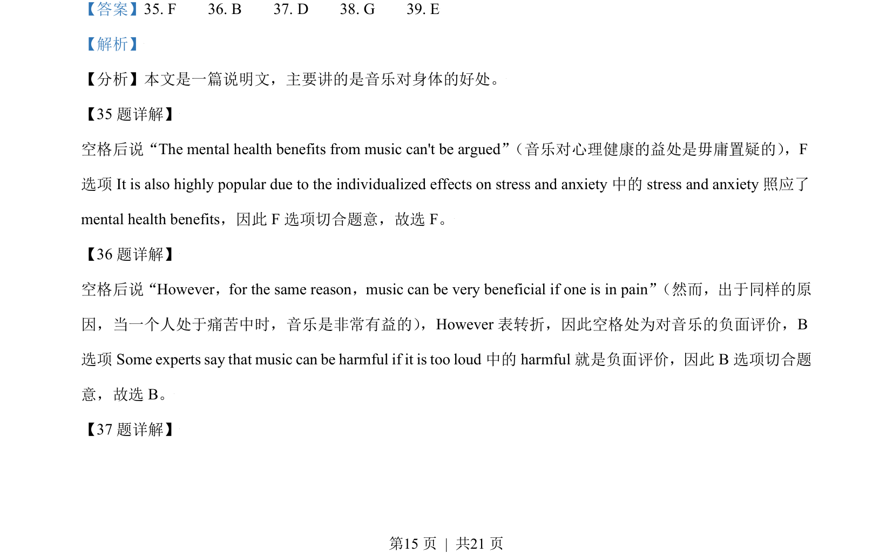
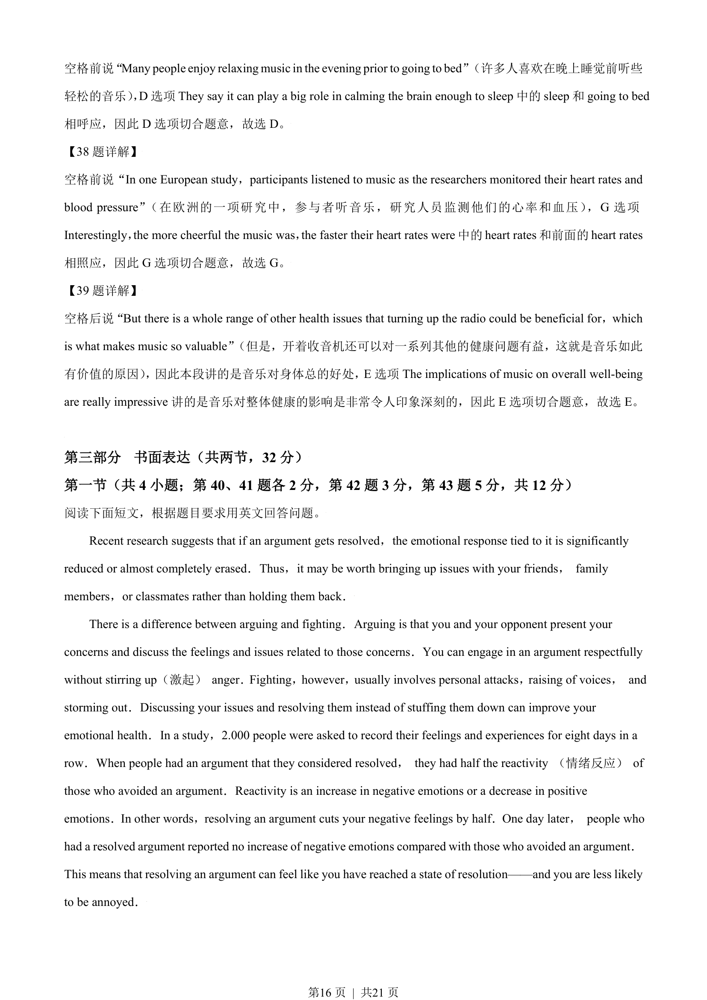
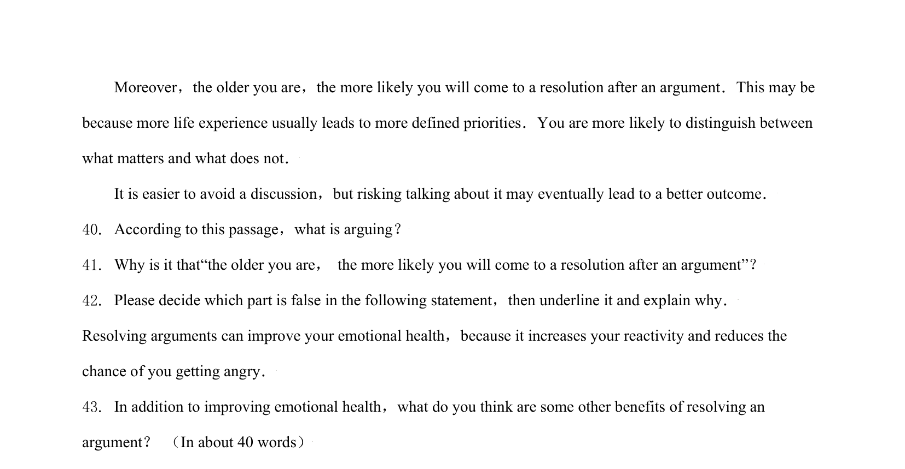

## 篇章题面

## 摘要

【分析】这是一篇说明文。最近的研究表明，如果争吵得到解决，与之相关的情绪反应会显著减少或几乎 完全消除。因此，向你的朋友、家人或同学提出问题可能是值得的，而不是阻止他们。

## 关联考点

- [[1032-阅读表达|阅读表达]]
- [[1030-信息归纳|信息归纳]]

## 答案

`40. Arguing is discussing your worries，related feelings and problems with the other party． 41. It is because more life experience may help people better identify priorities in life． 42. Resolving arguments can improve your emotional health，because it increases your reactivity and reduces the chance `

## 解析

> 📄 原 PDF 第 17 页：`素材/真题/北京/2008-2024·（北京）英语高考真题/2021年高考英语试卷（北京）（机考 无听力）（解析卷）.pdf`
