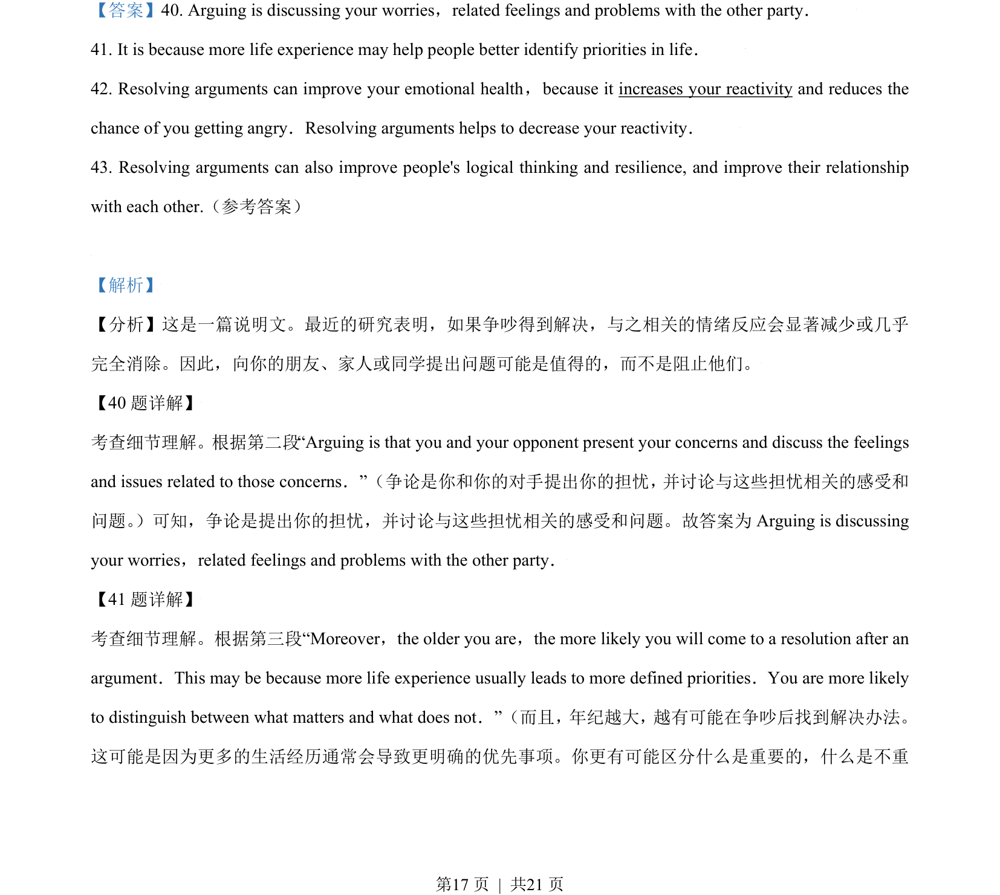
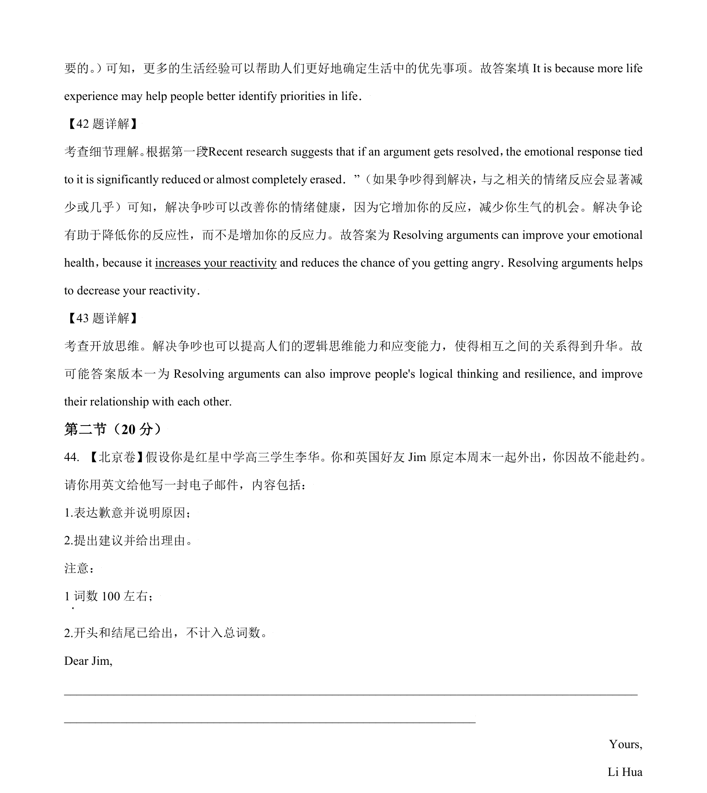
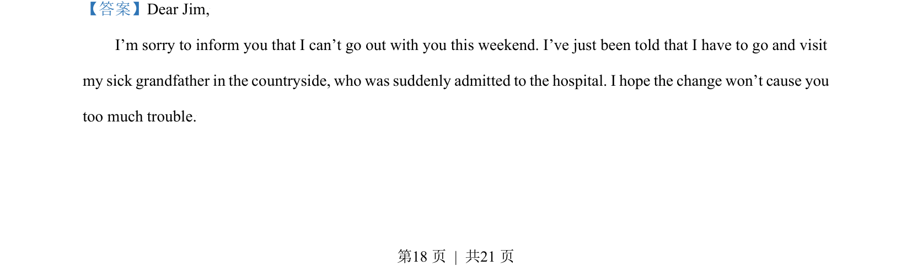
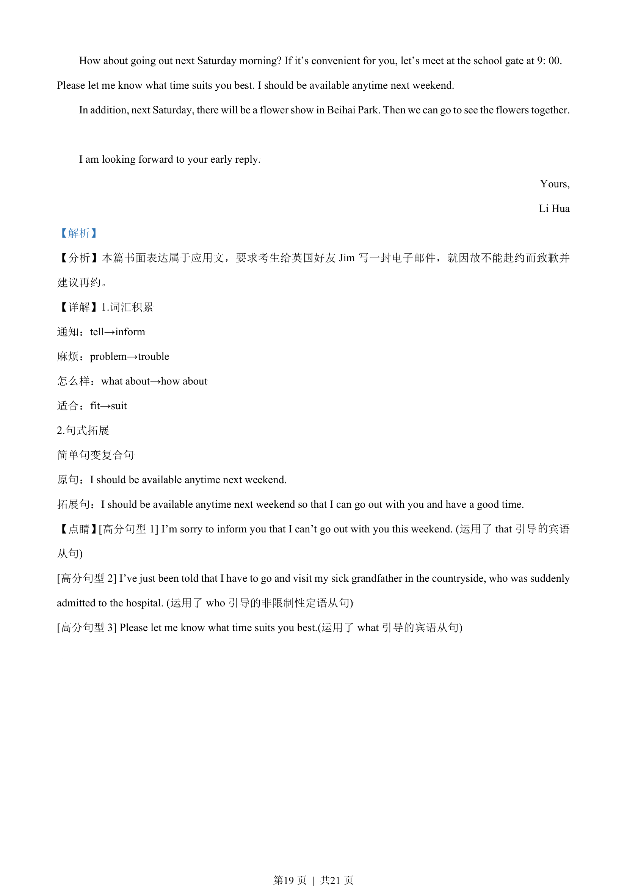

## 篇章题面

## 摘要

【分析】本篇书面表达属于应用文，要求考生给英国好友Jim 写一封电子邮件，就因故不能赴约而致歉并 建议再约。

## 关联考点

- [[996-书面表达|书面表达]]
- [[1007-应用文写作|应用文写作]]

## 答案

`Dear Jim, I’m sorry to inform you that I can’t go out with you this weekend. I’ve just been told that I have to go and visit my sick grandfather in the countryside, who was suddenly admitted to the hospital. I hope the change won’t cause you too much trouble. How about going out next Saturday mornin`

## 解析

> 📄 原 PDF 第 18 页：`素材/真题/北京/2008-2024·（北京）英语高考真题/2021年高考英语试卷（北京）（机考 无听力）（解析卷）.pdf`
