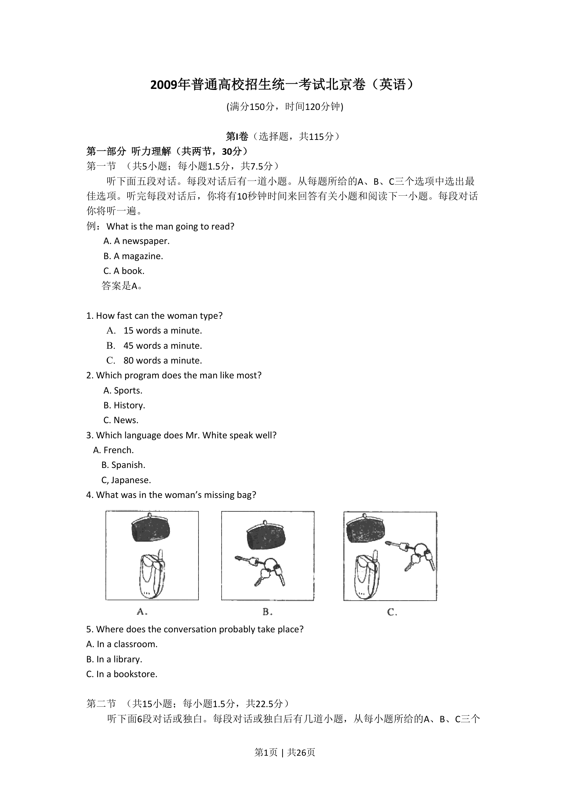
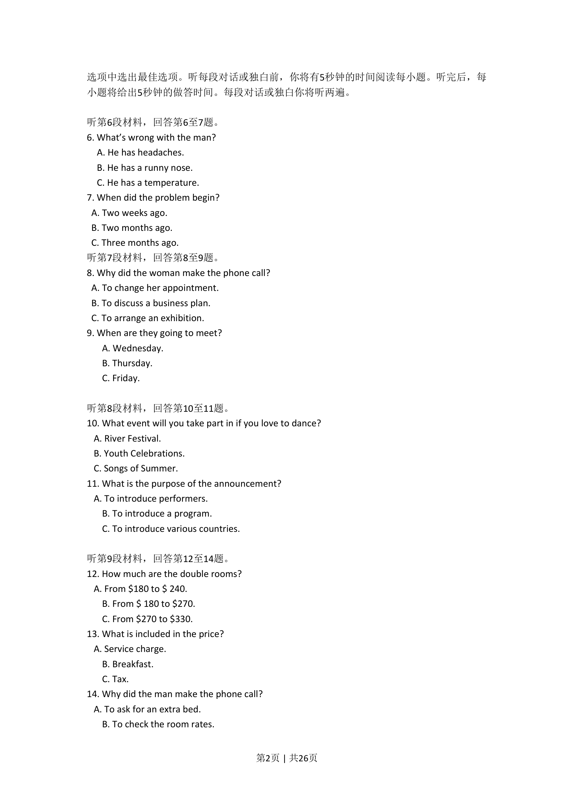
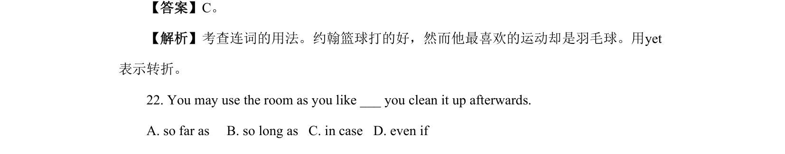
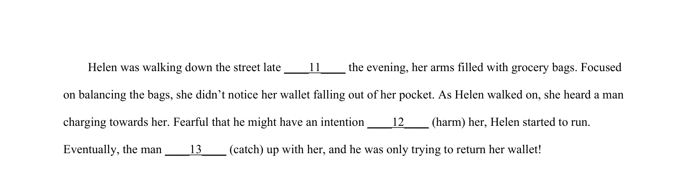

## 篇章题面

## 摘要

这是一篇记叙文。一个小男孩上学去晚了，被关在了门外，小男孩推不开门，于是大冬天的在门 外等了很久，直到老师不经意间发现门有动静，才注意到他被关在门外。小男孩坚定地相信老师会给他开 门，这种信念让老师一直铭记于心。

## 关联考点

- [[810-完形填空|完形填空]]
- [[900-词义辨析|词义辨析]]
- [[908-语境理解|语境理解]]

## 答案

`1. B 2. D 3. B 4. C 5. A 6. C 7. D 8. B 9. A 10. C`

## 解析

> 📄 原 PDF 第 2 页：`素材/真题/北京/2008-2024·（北京）英语高考真题/2022年高考英语试卷（北京）（机考 无听力）（解析卷）.pdf`
