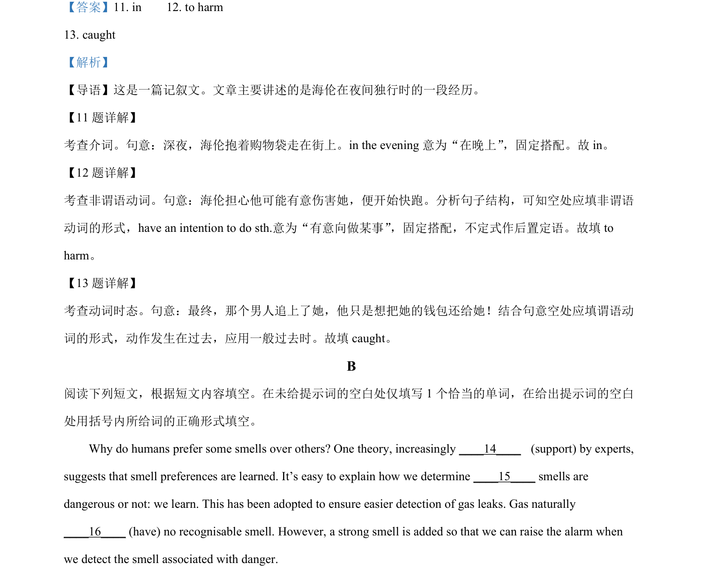
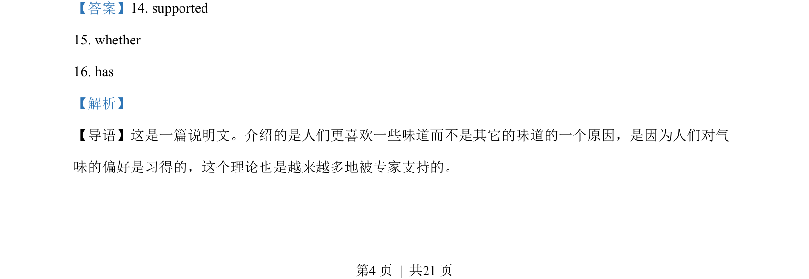
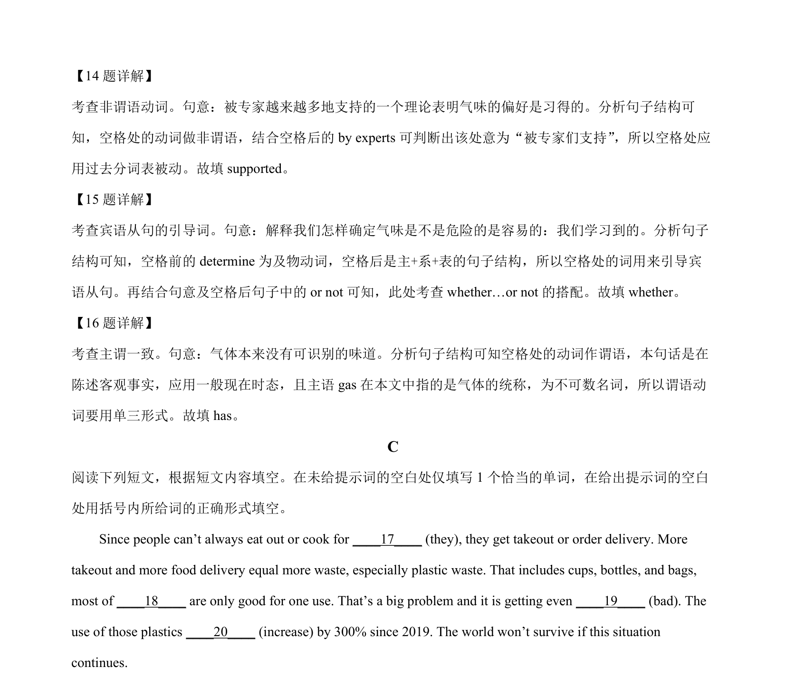

## 篇章题面

## 摘要

这是一篇说明文。介绍的是人们更喜欢一些味道而不是其它的味道的一个原因，是因为人们对气 味的偏好是习得的，这个理论也是越来越多地被专家支持的。

## 关联考点

- [[1031-语篇填空|语篇填空]]
- [[1018-语法填空|语法填空]]

## 答案

`14. supported 15. whether 16. has`

## 解析

> 📄 原 PDF 第 4 页：`素材/真题/北京/2008-2024·（北京）英语高考真题/2022年高考英语试卷（北京）（机考 无听力）（解析卷）.pdf`
