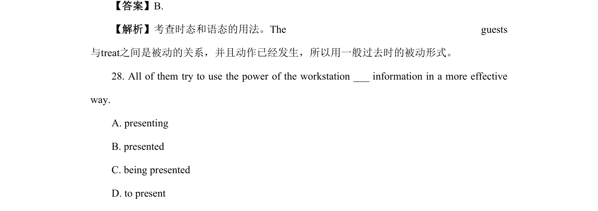
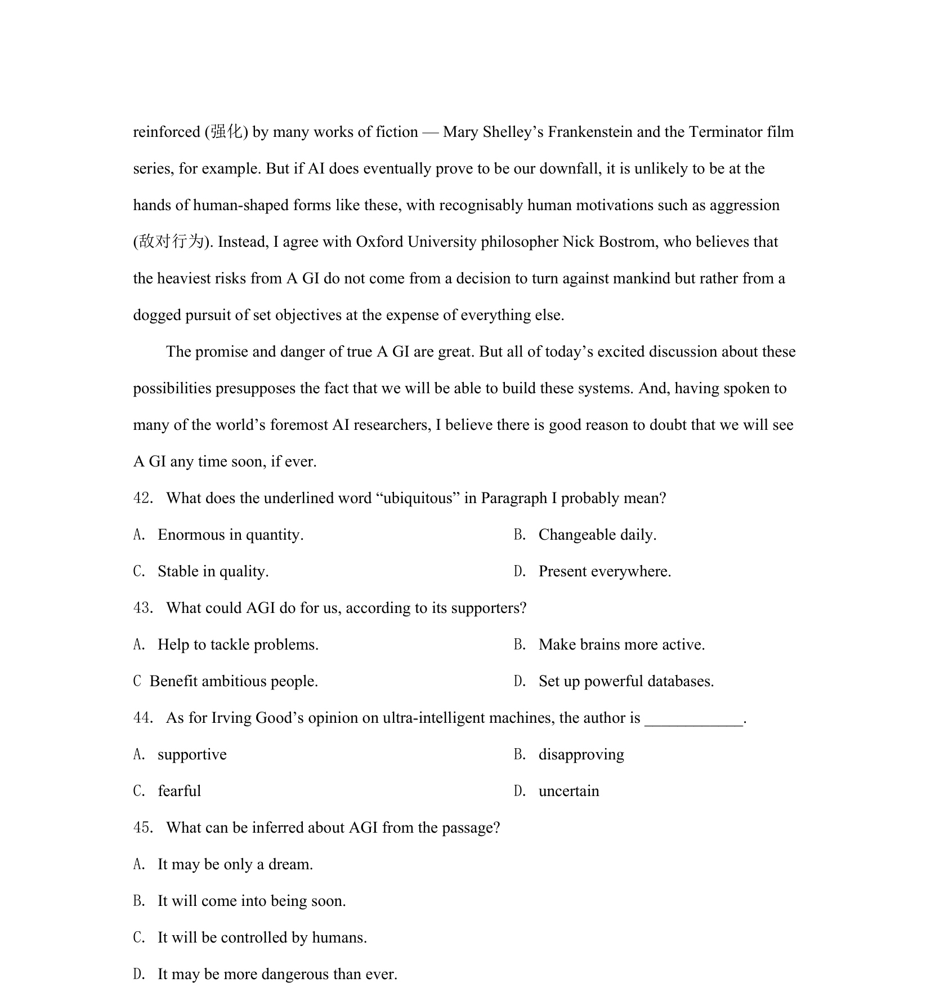

## 篇章题面

## 摘要

本文是一篇议论文。主要论述了“量子计算真的会像它的宣传那样成功吗？”，计算机科学家克 里斯·约翰逊和物理学家菲利普·泰勒分别阐明了自己的观点。

## 关联考点

- [[724-reading comprehension|阅读理解]]
- [[689-Specific Information|细节理解]]
- [[887-推理判断|推理判断]]
- [[175-议论文入门|议论文]]

## 答案

`31. A 32. C 33. A 34. D`

## 解析

> 📄 原 PDF 第 13 页：`素材/真题/北京/2008-2024·（北京）英语高考真题/2022年高考英语试卷（北京）（机考 无听力）（解析卷）.pdf`
