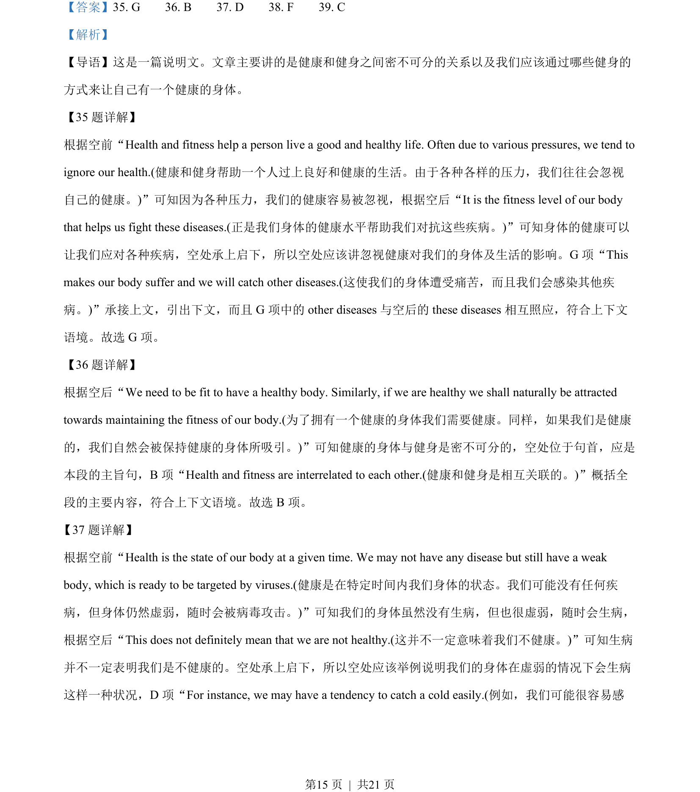
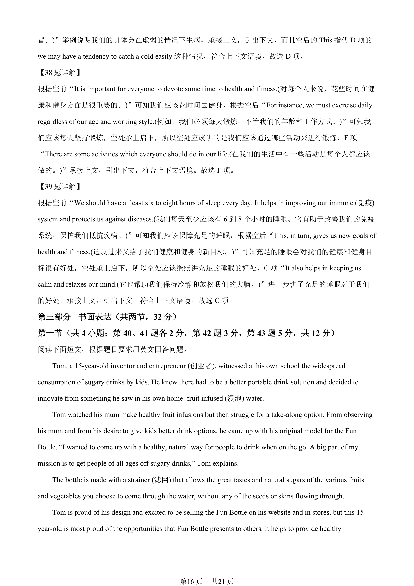
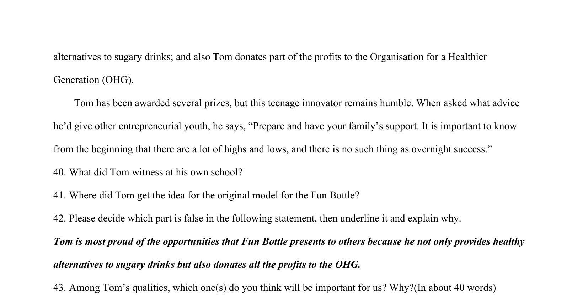
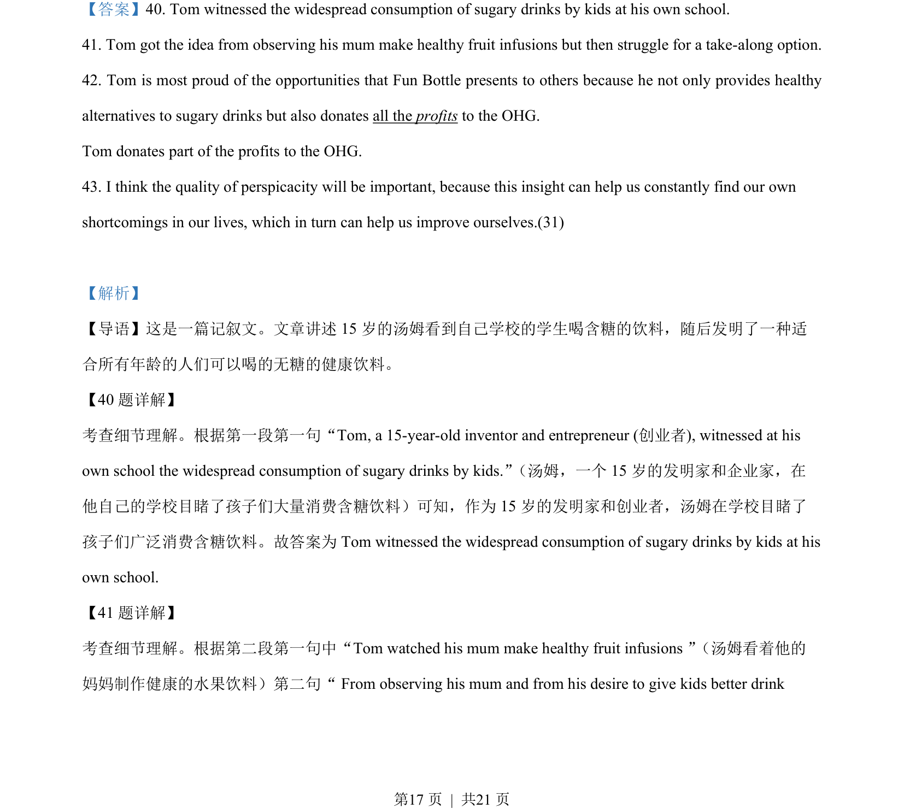
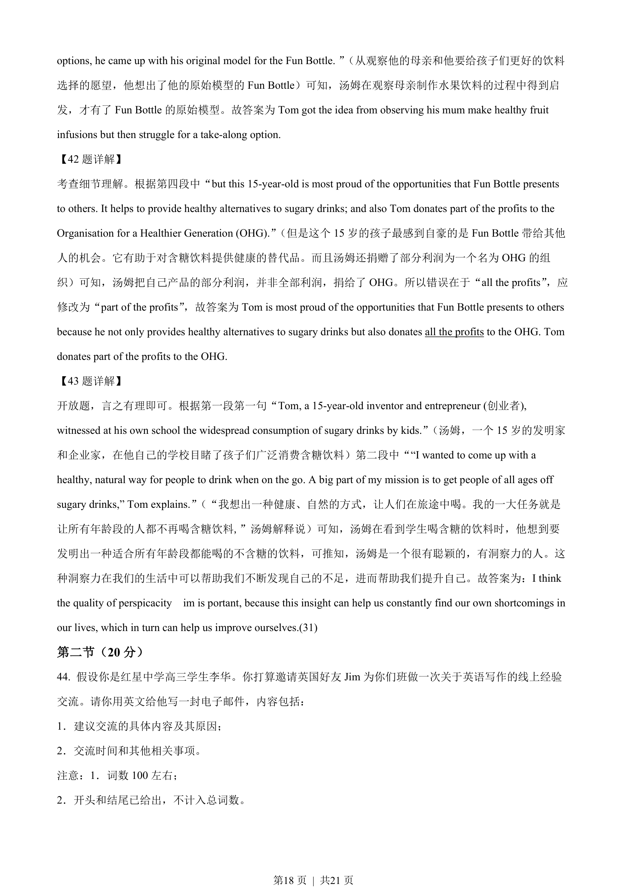

## 篇章题面

## 摘要

这是一篇记叙文。文章讲述15 岁的汤姆看到自己学校的学生喝含糖的饮料，随后发明了一种适 合所有年龄的人们可以喝的无糖的健康饮料。

## 关联考点

- [[1032-阅读表达|阅读表达]]
- [[1030-信息归纳|信息归纳]]

## 答案

`40. Tom witnessed the widespread consumption of sugary drinks by kids at his own school. 41. Tom got the idea from observing his mum make healthy fruit infusions but then struggle for a take-along option. 42. Tom is most proud of the opportunities that Fun Bottle presents to others because he not on`

## 解析

> 📄 原 PDF 第 17 页：`素材/真题/北京/2008-2024·（北京）英语高考真题/2022年高考英语试卷（北京）（机考 无听力）（解析卷）.pdf`
